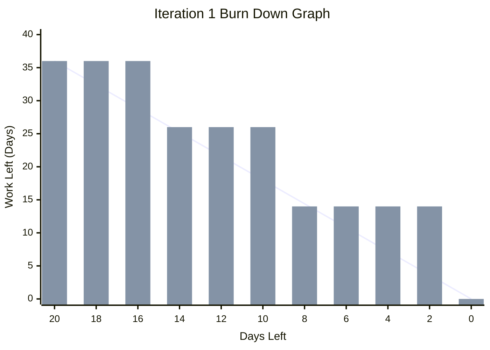
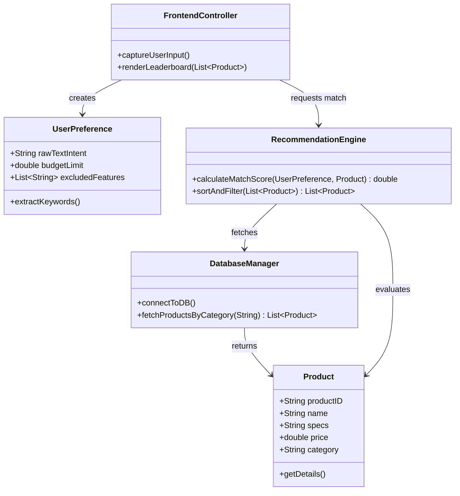
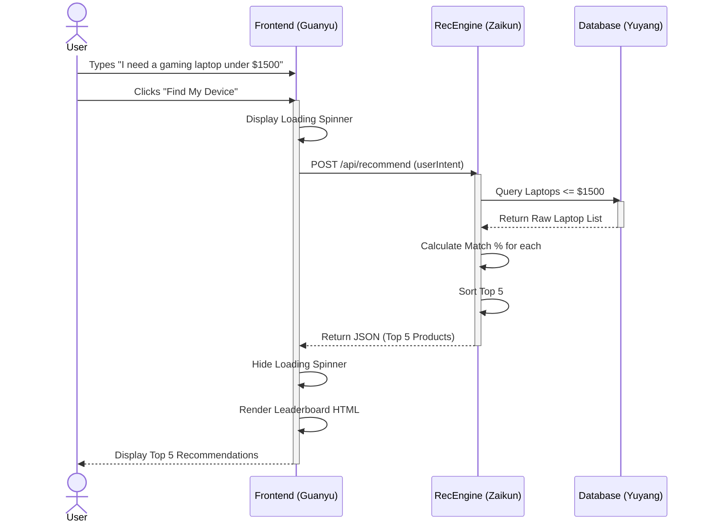

# CP3407---Smart Digital Product Recommendation Platform

Welcome to the Smart Digital Product Recommendation Platform repository. This project aims to help users find the most suitable digital products (e.g., laptops, smartphones, peripherals) that fit their budget and needs through intelligent and personalized assessment algorithms, simplifying the decision-making process in a tech market filled with overwhelming information.

---

## 1. Project Overview
In today's tech market, digital products iterate rapidly with complex specifications. Average consumers often face "choice paralysis" and information overload. This project will develop a web-based smart digital product recommendation platform. Users only need to complete a short interactive questionnaire. The platform will then filter and match products from the database using a core recommendation algorithm, providing users with intuitive quantitative recommendation scores and comprehensive spec comparisons to simplify their decision-making process.

---

## 2. Objectives
* **Accurate Matching:** Build a recommendation algorithm engine capable of efficient matching based on user inputs (e.g., primary use case, budget, brand preference, hardware requirements).
* **User-Friendly Interface:** Create a highly available, responsive web frontend providing intuitive product discovery, comparison, and visual charts.
* **Stable Infrastructure:** Establish secure and scalable backend and database services to support the storage of hardware specs, efficient queries, and the security of user data.

---

## 3. Features
* **Smart Assessment:** Provide a quick, intuitive, personalized questionnaire (e.g., budget range, primary scenarios like 3D modeling/gaming/office work, portability or battery life preferences).
* **Personalized Recommendations:** Display the top 3 recommended digital products based on matching scores, along with reasons for the recommendation.
* **Product Comparison:** Allow users to compare multiple recommended products side-by-side, clearly displaying core specs like CPU, GPU, RAM, and price in a table format.
---

## 4. Technology Stack
* **Frontend:** to be confirmed
* **Backend:** Python 
* **Database:** to be confirmed
* **Design/UI:** Figma (for rapid prototyping and testing based on Lean UX principles)
* **IDE & Tools:** Git/GitHub, PyCharm
---

## 5. Team Members & Roles
This project is collaboratively developed by a team of 4 members. The specific roles and responsibilities are as follows:

| Name | Project Role | Key Responsibilities |
| :--- | :--- | :--- |
| **Junjie Chu** | Project Manager | Overall project schedule management, task allocation, agile iteration advancement, and writing Practical reports. |
| **Guanyu Lu** | UI/UX Designer & Frontend Developer | UI/UX interaction design (Figma prototypes), frontend page development, and component interaction implementation. |
| **Zaikun Zheng**| Backend & Algorithm Engineer | Backend API development, core recommendation algorithm, and matching logic design/implementation. |
| **Yuyang Zhou** | Database Administrator | Digital product dataset cleaning, database schema design, AWS/local database deployment, and performance tuning. |

---

## 6. Milestone 1 & Iteration Planning

To effectively manage our development cycle and deliver a high-quality product, we have structured Milestone 1 into three distinct iterations based on user story priorities and effort estimations. 

### 🌟 Iteration 1: MVP Core Pipeline (Total Effort: 11 Days)
* **Goal:** Successfully run the core data flow: "Database Setup -> Natural Language Input Processing -> Recommendation Leaderboard Display".
* **Current Focus:** Week 3 Practical Target.

| ID | Title | User Story | Priority | Effort (Days) | Status |
| :--- | :--- | :--- | :--- | :--- | :--- |
| **US-01** | Natural Language Needs Description | **As a** consumer with limited hardware knowledge, **I want to** describe my usage habits in everyday natural language (e.g., "a durable phone with a big screen for my mom"), **so that** the system can understand my real needs without requiring me to research technical specs. | 10 | 12 | 🟢 Done |
| **US-02** | Database Setup & Import | **As a** system administrator, **I want to** import a digital product dataset (e.g., CSV format) into the database, **so that** the platform has enough underlying data to support queries and recommendations. | 10 | 10 | 🟢 Done |
| **US-03** | Customized Leaderboard | **As a** buyer looking for a new device, **I want to** see a Top 5 recommended leaderboard immediately after entering my needs, clearly displaying the matching percentage, **so that** I can intuitively compare and make a quick purchasing decision. | 10 | 14 | 🟢 Done |

### ⏱️ Actual Velocity Calculation for Iteration 1
Velocity is a measure of how much work our team successfully completed in this iteration. We only count the estimates of *100% completed* user stories.

* US-01 Estimate: 12 Days (Completed)
* US-02 Estimate: 10 Days (Completed)
* US-03 Estimate: 14 Days (Completed)

**Actual Velocity = 12 + 10 + 14 = 36 Days**

**Conclusion:** Our team's actual velocity for Iteration 1 exactly matches our initial planned capacity (36 Days). This proves that our task breakdowns and estimations were highly accurate, giving us a reliable baseline (Velocity = 36/20*4=0.45) for planning Iteration 2!

### 📉 Burn Down Graph
Below is the Burn Down Graph for tracking the remaining effort during Iteration 1. The total estimated effort starts at 11 days and is planned to burn down linearly to 0 by Day 10.

---

### 🔍 Iteration 2: Decision Support & Feature Filtering (Total Effort: 8 Days)
* **Goal:** Enhance recommendation transparency and implement advanced preference filtering.

| ID | Title | User Story | Priority | Effort (Days) | Status |
| :--- | :--- | :--- | :--- | :--- | :--- |
| **US-04** | Personalized Explanation | **As a** skeptical user, **I want to** read a one-sentence, easy-to-understand explanation below each recommended product, **so that** I understand exactly why it was matched to me and can trust the recommendation. | 20 | 13 | ⚪ Todo |
| **US-05** | Product Spec Comparison | **As a** consumer, **I want to** select multiple products and view their hardware specs side-by-side in a table format, **so that** I can intuitively see the differences in components like RAM and processors. | 20 | 10 | ⚪ Todo |
| **US-06** | Exclude Unwanted Features | **As a** user with strict personal preferences, **I want to** list features I absolutely cannot accept (e.g., "no curved screens"), **so that** the system automatically filters out products with these dealbreakers. | 30 | 13 | ⚪ Todo |

---

### 🚀 Iteration 3: Conversion, Feedback & Sharing (Total Effort: 11 Days)
* **Goal:** Implement external e-commerce redirection, social sharing, and user feedback loops for continuous algorithm improvement.

| ID | Title | User Story | Priority | Effort (Days) | Status |
| :--- | :--- | :--- | :--- | :--- | :--- |
| **US-07** | Direct Purchase Links | **As an** eager buyer, **I want to** click on a recommended product to be redirected to official e-commerce stores, **so that** I can make a purchase directly without manually searching for it elsewhere. | 40 | 7 | ⚪ Todo |
| **US-08** | Feedback Mechanism | **As an** engaged user, **I want to** click a "thumbs up" or "thumbs down" button at the bottom of the leaderboard, **so that** I can provide feedback to the developers to improve future algorithm accuracy. | 40 | 7 | ⚪ Todo |
| **US-09** | Budget Alternatives | **As a** budget-conscious consumer, **I want to** see a cheaper "budget alternative" for top-tier expensive recommendations, **so that** I can save money without sacrificing core experiences. | 50 | 12 | ⚪ Todo |
| **US-10** | Share Leaderboard | **As a** user helping family or friends choose a device, **I want to** generate a shareable link of the customized leaderboard, **so that** I can easily send the tailored recommendation results for them to view on their own devices. | 50 | 10 | ⚪ Todo |
---

## 7. System Architecture & Modeling

To ensure a robust and scalable platform, we have utilized UML modeling to represent the core domain logic and the runtime interactions between our frontend UI, backend engine, and database.

### 🧩 Class Diagram
The static structure below illustrates the main entities of our recommendation platform and their relationships:

### 🔎 Design Principles Check (SRP & DRY)
During the end of Iteration 1, we reviewed our Class Diagram against the core principles from Chapter 5:

**1. Single Responsibility Principle (SRP):**
*Our classes satisfy SRP because each class has only one reason to change:*
* `DatabaseManager`: Only handles database connection and raw data fetching. It does not care about how products are matched or displayed.
* `RecommendationEngine`: Only handles the mathematical matching logic (calculating scores).
* `FrontendController`: Strictly focuses on capturing user input and rendering the UI. It delegates all heavy lifting to the Engine.

**2. Don't Repeat Yourself (DRY):**
*We applied the DRY principle in our frontend code:*
* Instead of writing duplicate HTML code for each of the Top 5 products, we created a single reusable JavaScript function `renderLeaderboard(data)`. It iterates through the array and dynamically generates the UI components, ensuring that if we want to change the card style in the future, we only need to update the code in one place.

### 🔄 Sequence Diagram
The dynamic behavior below maps out the execution flow of US-01 to US-03, showing how natural language input gets processed into a Top 5 leaderboard:

---
## 8. Data and Privacy
* The digital product specifications (e.g., price, processor, GPU, RAM) used by this platform are sourced from public channels or open-source datasets.
* The platform strictly adheres to privacy protection principles. All preference data inputted by users in the questionnaire is only used for real-time calculation of the current recommendation and will never be disclosed to any third party without permission.
