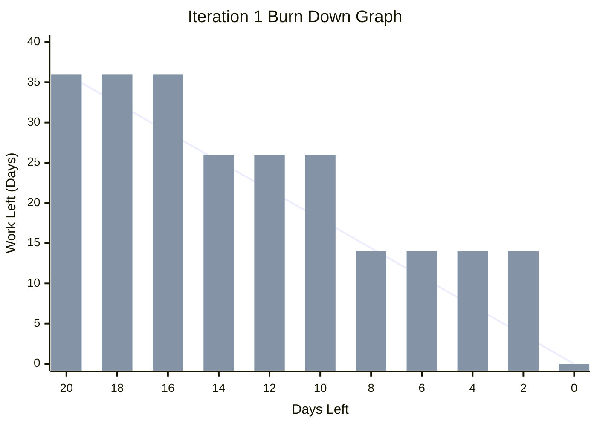
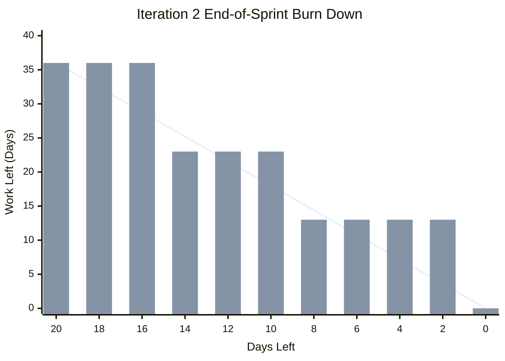
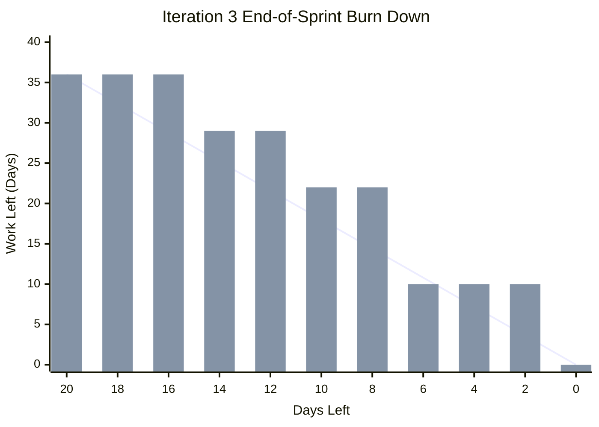
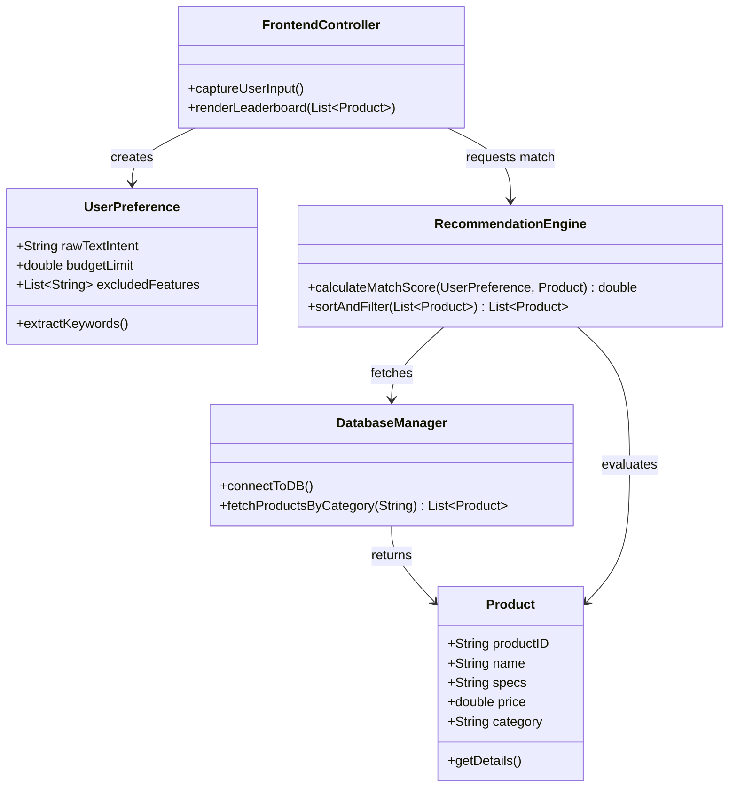
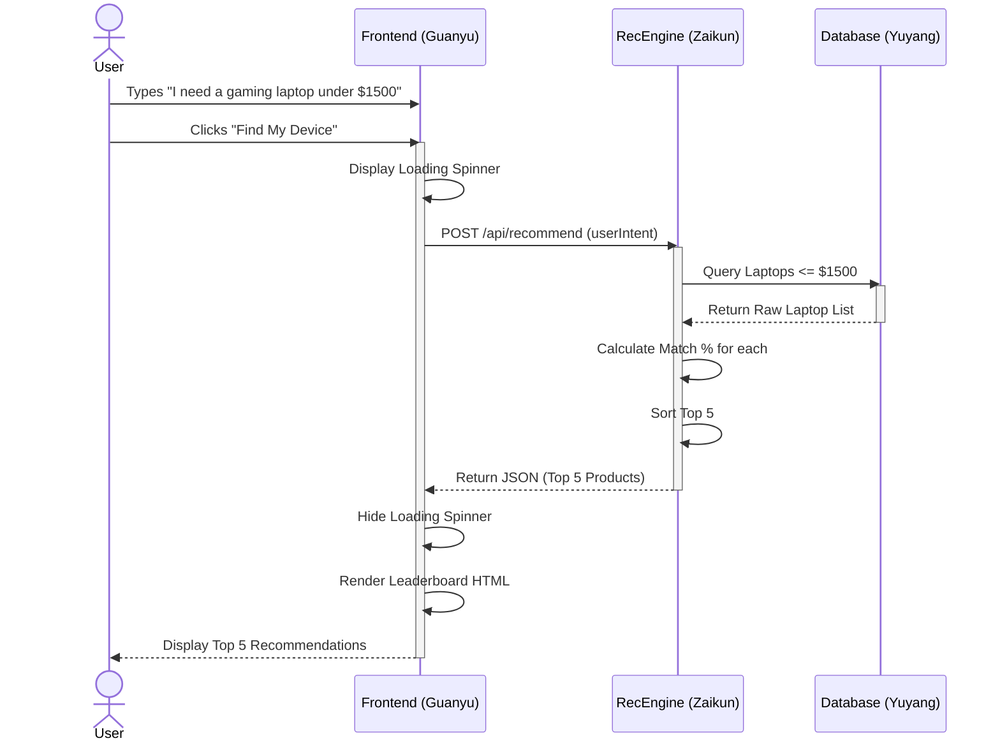

# CP3407---Smart Digital Product Recommendation Platform

> **Teacher-feedback revision (5 August 2026):** this working copy supersedes the earlier Top-5/CSV prototype described later in this historical README. It now uses SQLAlchemy with PostgreSQL support, stores 2,000 recommendation-ready public-dataset records in the bundled SQLite database, supports registration/login and persistent search history, and exposes every matching result through 20-item pagination. See [Teacher Feedback Change Request](docs/teacher-feedback-change-request.md).

## Current runnable version

- `server.py`: Flask API, authentication, recommendation, comparison, feedback and history.
- `digital_products.db`: local SQLite database containing 11,000 product rows, including 2,000 joined real-name catalogue/specification records.
- `index.html`: static frontend for GitHub Pages; production API base URL points to Render.
- Production database: set `DATABASE_URL` to a Render PostgreSQL connection string. Without it, the app uses local SQLite.
- Catalogue disclosure: the 2,000 active recommendation records come from attributed public datasets. They are historical snapshots, not live retail inventory or live prices. Missing specifications remain `Not specified` rather than being invented.
- Account center: the avatar in the top-right opens persistent favorites and search history. Users can compare 2–3 favorite products when they belong to the same product category.

### Run locally

```bash
python3 -m venv .venv
.venv/bin/pip install -r requirements.txt
.venv/bin/python server.py
```

Serve `index.html` from another terminal with `python3 -m http.server 8000`, then open `http://127.0.0.1:8000`. Run automated checks with `.venv/bin/pytest -q`.

### Catalogue sources and transformations

Retrieved 5 August 2026. Each database row retains its source in `product_specs.DataSource`.

| Active category | Rows | Public source | Licence | Price treatment |
|---|---:|---|---|---|
| Laptops | 800 | [Laptop Price dataset](https://www.kaggle.com/datasets/ironwolf437/laptop-price-dataset) | Apache 2.0 | Historical EUR converted at fixed `1 EUR = 1.08 USD` |
| Smartphones | 833 | [Smartphone Dataset](https://www.kaggle.com/datasets/muzammilbaloch/smartphone-dataset) | Apache 2.0 | Historical INR converted at fixed `1 USD = 83 INR` |
| Smart Watches | 300 | [Fitness Trackers Products Ecommerce](https://www.kaggle.com/datasets/devsubhash/fitness-trackers-products-ecommerce) | CC BY-SA 4.0 | Historical INR converted at fixed `1 USD = 83 INR` |
| Headphones | 61 | [Datafiniti Electronics Product Pricing](https://www.kaggle.com/datasets/manishkc06/electronics-product-pricing-dataset) | CC0 | Historical USD; median of recorded merchant prices per product |
| Tablets | 6 | Same Datafiniti source | CC0 | Historical USD; median of recorded merchant prices per product |

`import_real_catalog.py` reproduces the import, outputs `real_product_catalog.csv` for human inspection, sanitizes users/history/favorites/feedback, and validates table/category counts. The 9,000 older behavioural rows remain for project continuity but do not participate in recommendations unless they have a matching `product_specs` row.

### Render configuration

Use build command `pip install -r requirements.txt` and start command `gunicorn server:app`. Add a Render PostgreSQL database and set `DATABASE_URL` and a random 32+ character `JWT_SECRET_KEY` on the web service. A free ephemeral web-service filesystem must not be relied on for user accounts or history; PostgreSQL provides persistence across deploys/restarts.

Welcome to the Smart Digital Product Recommendation Platform repository. This project aims to help users find the most suitable digital products (e.g., laptops, smartphones, peripherals) that fit their budget and needs through intelligent and personalized assessment algorithms, simplifying the decision-making process in a tech market filled with overwhelming information.

🌟 **Live Demo:** [Click here to experience our Iteration 1 Platform](https://chu-junjie.github.io/CP3407-PROJECT/)

---

## 1. Project Overview
In today's tech market, digital products iterate rapidly with complex specifications. Average consumers often face "choice paralysis" and information overload. This project will develop a web-based smart digital product recommendation platform. Users only need to complete a short interactive questionnaire. The platform will then filter and match products from the database using a core recommendation algorithm, providing users with intuitive quantitative recommendation scores and comprehensive spec comparisons to simplify their decision-making process.

---

## 2. Objectives
* **Accurate Matching:** Build a recommendation algorithm engine capable of efficient matching based on user inputs (e.g., primary use case, budget, brand preference, hardware requirements).
* **User-Friendly Interface:** Create a highly available, responsive web frontend providing intuitive product discovery, comparison, and visual charts.
* **Stable Infrastructure:** Establish secure and scalable backend and database services to support the storage of hardware specs, efficient queries, and the security of user data.

---

## 3. Features
* **Smart Assessment:** Provide a quick, intuitive, personalized questionnaire (e.g., budget range, primary scenarios like 3D modeling/gaming/office work, portability or battery life preferences).
* **Personalized Recommendations:** Rank matching products, highlight the top five, and let users browse every match through pagination with explanations and scores.
* **Product Comparison:** Allow users to compare multiple recommended products side-by-side, clearly displaying core specs like CPU, GPU, RAM, and price in a table format.
* **Accounts and History:** Register or log in to preserve searches and reopen result snapshots later.
---

## 4. Technology Stack
* **Frontend:** HTML, CSS and JavaScript (GitHub Pages)
* **Backend:** Python, Flask and SQLAlchemy (Render)
* **Database:** SQLite for the bundled demonstration; PostgreSQL through `DATABASE_URL` for persistent production use
* **Design/UI:** Figma (for rapid prototyping and testing based on Lean UX principles)
* **IDE & Tools:** Git/GitHub, PyCharm
---

## 5. Team Members & Roles
This project is collaboratively developed by a team of 4 members. The specific roles and responsibilities are as follows:

| Name | Project Role | Key Responsibilities |
| :--- | :--- | :--- |
| **Junjie Chu** | Project Manager | Overall project schedule management, task allocation, agile iteration advancement, and writing Practical reports. |
| **Guanyu Lu** | UI/UX Designer & Frontend Developer | UI/UX interaction design (Figma prototypes), frontend page development, and component interaction implementation. |
| **Zaikun Zheng**| Backend & Algorithm Engineer | Backend API development, core recommendation algorithm, and matching logic design/implementation. |
| **Yuyang Zhou** | Database Administrator | Public product dataset cleaning/import, database schema design, SQLite/PostgreSQL integration, data-provenance documentation, and verification. |

---

## 6. Milestone 1 & Iteration Planning

To effectively manage our development cycle and deliver a high-quality product, we have structured Milestone 1 into three distinct iterations based on user story priorities and effort estimations. 

### 🌟 Iteration 1: MVP Core Pipeline (Total Effort: 36 Days)
* **Goal:** Successfully run the core data flow: "Database Setup -> Natural Language Input Processing -> Recommendation Leaderboard Display".
* **Current Focus:** Week 3 Practical Target.

| ID | Title | User Story | Priority | Effort (Days) | Status |
| :--- | :--- | :--- | :--- | :--- | :--- |
| **US-01** | Natural Language Needs Description | **As a** consumer with limited hardware knowledge, **I want to** describe my usage habits in everyday natural language (e.g., "a durable phone with a big screen for my mom"), **so that** the system can understand my real needs without requiring me to research technical specs. | 10 | 12 | 🟢 Done |
| **US-02** | Database Setup & Import | **As a** system administrator, **I want to** import a digital product dataset (e.g., CSV format) into the database, **so that** the platform has enough underlying data to support queries and recommendations. | 10 | 10 | 🟢 Done |
| **US-03** | Customized Leaderboard | **As a** buyer looking for a new device, **I want to** see a Top 5 recommended leaderboard immediately after entering my needs, clearly displaying the matching percentage, **so that** I can intuitively compare and make a quick purchasing decision. | 10 | 14 | 🟢 Done |

### ⏱️ Actual Velocity Calculation for Iteration 1
Velocity is a measure of how much work our team successfully completed in this iteration. We only count the estimates of *100% completed* user stories.

* US-01 Estimate: 12 Days (Completed)
* US-02 Estimate: 10 Days (Completed)
* US-03 Estimate: 14 Days (Completed)

**Velocity**:36 Days /(20 working days * 4 teammates) =  **0.45**

**Conclusion:** Our team's actual velocity for Iteration 1 exactly matches our initial planned capacity (36 Days). This proves that our task breakdowns and estimations were highly accurate, giving us a reliable baseline for planning Iteration 2!

### 📉 Burn Down Graph
Below is the Burn Down Graph for tracking the remaining effort during Iteration 1. The total estimated effort starts at 11 days and is planned to burn down linearly to 0 by Day 10.


```mermaid
xychart-beta
    title "Iteration 1 Burn Down Graph"
    x-axis "Days Left" [20, 18, 16, 14, 12, 10, 8, 6, 4, 2, 0]
    y-axis "Work Left (Days)" 0 --> 40
    line "Ideal Trend" [36, 32.4, 28.8, 25.2, 21.6, 18.0, 14.4, 10.8, 7.2, 3.6, 0]
    bar "Actual Remaining" [36, 36, 36, 26, 26, 26, 14, 14, 14, 14, 0]
```
### Document: Completed vs. Unfinished User Stories (Iteration 1 Review)
At the end of Iteration 1, we conducted a Sprint Review to evaluate our deliverables against our initial commitments.

**✅ Completed User Stories (Total: 36 Days)**
* **US-01 (12 Days):** MVP Frontend UI for natural language input is fully functional.
* **US-02 (10 Days):** Database setup and initial digital product dataset imported successfully.
* **US-03 (14 Days):** Frontend leaderboard dynamically renders top recommendations based on mock integrated data.

**❌ Unfinished User Stories (Total: 0 Days)**
* *None.* All planned tasks for Iteration 1 were 100% successfully executed and merged into the main branch. No technical debt or unfinished stories need to be carried over to Iteration 2.
---

### 🔍 Iteration 2: Decision Support & Feature Filtering (Total Effort: 36 Days)
* **Goal:** Enhance recommendation transparency and implement advanced preference filtering.

| ID | Title | User Story | Priority | Effort (Days) | Status |
| :--- | :--- | :--- | :--- | :--- | :--- |
| **US-04** | Personalized Explanation | **As a** skeptical user, **I want to** read a one-sentence, easy-to-understand explanation below each recommended product, **so that** I understand exactly why it was matched to me and can trust the recommendation. | 20 | 13 | 🟢 Done |
| **US-05** | Product Spec Comparison | **As a** consumer, **I want to** select multiple products and view their hardware specs side-by-side in a table format, **so that** I can intuitively see the differences in components like RAM and processors. | 20 | 10 | 🟢 Done|
| **US-06** | Exclude Unwanted Features | **As a** user with strict personal preferences, **I want to** list features I absolutely cannot accept (e.g., "no curved screens"), **so that** the system automatically filters out products with these dealbreakers. | 30 | 13 | 🟢 Done |

### ⏱️ Actual Velocity Calculation for Iteration 2
At the end of Iteration 2, our team successfully completed all planned tasks focusing on decision support and filtering. 

* **US-04 Estimate:** 13 Days (Completed)
* **US-05 Estimate:** 10 Days (Completed)
* **US-06 Estimate:** 13 Days (Completed)

**Velocity**:36 Days /(20 working days * 4 teammates) =  **0.45**

**Reflection:** Our actual velocity (36 Days) perfectly matches our projected capacity. This indicates our team's estimation accuracy and focus factor  have stabilized. We will use this exact velocity of **36 Days** as the rigid baseline to plan our final sprint (Iteration 3).

### 📉 Iteration 2 Burn Down Graph
Below is the Burn Down Graph for Iteration 2. The effort started at 36 days and successfully burned down to 0, demonstrating a healthy Agile cadence where tasks were sequentially moved to 'Done'.


```mermaid
xychart-beta
    title "Iteration 2 End-of-Sprint Burn Down"
    x-axis "Days Left" [20, 18, 16, 14, 12, 10, 8, 6, 4, 2, 0]
    y-axis "Work Left (Days)" 0 --> 40
    line "Ideal Trend" [36, 32.4, 28.8, 25.2, 21.6, 18.0, 14.4, 10.8, 7.2, 3.6, 0]
    bar "Actual Remaining" [36, 36, 36, 23, 23, 23, 13, 13, 13, 13, 0]
```
---

### 🚀 Iteration 3: Conversion, Feedback & Sharing (Total Effort: 36 Days)
* **Goal:** Implement external e-commerce redirection, social sharing, and user feedback loops for continuous algorithm improvement.
 
Based on our Iteration 2 Actual Velocity of 36 Days, we have updated the backlog for Iteration 3 to exactly match this capacity.

| ID | Title | User Story | Priority | Effort (Days) | Status |
| :--- | :--- | :--- | :--- | :--- | :--- |
| **US-07** | Direct Purchase Links | **As an** eager buyer, **I want to** click on a recommended product to be redirected to official e-commerce stores, **so that** I can make a purchase directly without manually searching for it elsewhere. | 40 | 7 | 🟢 Done |
| **US-08** | Feedback Mechanism | **As an** engaged user, **I want to** click a "thumbs up" or "thumbs down" button at the bottom of the leaderboard, **so that** I can provide feedback to the developers to improve future algorithm accuracy. | 40 | 7 | 🟢 Done |
| **US-09** | Budget Alternatives | **As a** budget-conscious consumer, **I want to** see a cheaper "budget alternative" for top-tier expensive recommendations, **so that** I can save money without sacrificing core experiences. | 50 | 12 | 🟢 Done |
| **US-10** | Share Leaderboard | **As a** user helping family or friends choose a device, **I want to** generate a shareable link of the customized leaderboard, **so that** I can easily send the tailored recommendation results for them to view on their own devices. | 50 | 10 | 🟢 Done |

### ⏱️ Actual Velocity Calculation for Iteration 3

At the end of Iteration 3, our team successfully completed all planned tasks focusing on product conversion, user feedback and result sharing.

- **US-07 Estimate:** 7 Days (Completed)
- **US-08 Estimate:** 7 Days (Completed)
- **US-09 Estimate:** 12 Days (Completed)
- **US-10 Estimate:** 10 Days (Completed)

**Velocity**:36 Days /(20 working days * 4 teammates) = **0.45**

**Reflection:**  
Our actual velocity for Iteration 3 remained consistent with Iteration 1 and Iteration 2, both of which also achieved 36 days of completed work. This shows that the team maintained a stable delivery capacity across all three iterations.

In this iteration, the team extended the system beyond the core recommendation pipeline by adding product/source links, feedback, budget-oriented support and shareable recommendation results. The final velocity of **36 Days** confirms that the Iteration 3 backlog was planned within the team’s established capacity and completed as expected.

### 📉 Iteration 3 Burn Down Graph

Below is the Burn Down Graph for Iteration 3. The total estimated effort started at 36 days and gradually reduced to 0 as US-07, US-08, US-09 and US-10 were completed.


```mermaid
xychart-beta
    title "Iteration 3 End-of-Sprint Burn Down"
    x-axis "Days Left" [20, 18, 16, 14, 12, 10, 8, 6, 4, 2, 0]
    y-axis "Work Left (Days)" 0 --> 40
    line "Ideal Trend" [36, 32.4, 28.8, 25.2, 21.6, 18.0, 14.4, 10.8, 7.2, 3.6, 0]
    bar "Actual Remaining" [36, 36, 36, 29, 29, 22, 22, 10, 10, 10, 0]
```
---

## 7. System Architecture & Modeling

To ensure a robust and scalable platform, we have utilized UML modeling to represent the core domain logic and the runtime interactions between our frontend UI, backend engine, and database.

### 🧩 Class Diagram
The static structure below illustrates the main entities of our recommendation platform and their relationships:

```mermaid
classDiagram
    class UserPreference {
        +String rawTextIntent
        +double budgetLimit
        +List~String~ excludedFeatures
        +extractKeywords()
    }

    class Product {
        +String productID
        +String name
        +String specs
        +double price
        +String category
        +getDetails()
    }

    class RecommendationEngine {
        +calculateMatchScore(UserPreference, Product) double
        +sortAndFilter(List~Product~) List~Product~
    }

    class DatabaseManager {
        +connectToDB()
        +fetchProductsByCategory(String) List~Product~
    }

    class FrontendController {
        +captureUserInput()
        +renderLeaderboard(List~Product~)
    }

    FrontendController --> UserPreference : creates
    FrontendController --> RecommendationEngine : requests match
    RecommendationEngine --> DatabaseManager : fetches
    DatabaseManager --> Product : returns
    RecommendationEngine --> Product : evaluates
```
### 🔎 Design Principles Check (SRP & DRY)
During the end of Iteration 1, we reviewed our Class Diagram against the core principles from Chapter 5:

**1. Single Responsibility Principle (SRP):**
*Our classes satisfy SRP because each class has only one reason to change:*
* `DatabaseManager`: Only handles database connection and raw data fetching. It does not care about how products are matched or displayed.
* `RecommendationEngine`: Only handles the mathematical matching logic (calculating scores).
* `FrontendController`: Strictly focuses on capturing user input and rendering the UI. It delegates all heavy lifting to the Engine.

**2. Don't Repeat Yourself (DRY):**
*We applied the DRY principle in our frontend code:*
* Instead of writing duplicate HTML code for each of the Top 5 products, we created a single reusable JavaScript function `renderLeaderboard(data)`. It iterates through the array and dynamically generates the UI components, ensuring that if we want to change the card style in the future, we only need to update the code in one place.

### 🔄 Sequence Diagram
The dynamic behavior below maps out the execution flow of US-01 to US-03, showing how natural language input gets processed into a Top 5 leaderboard:


```mermaid
sequenceDiagram
    actor User
    participant UI as Frontend (Guanyu)
    participant Engine as RecEngine (Zaikun)
    participant DB as Database (Yuyang)

    User->>UI: Types "I need a gaming laptop under $1500"
    User->>UI: Clicks "Find My Device"
    activate UI
    UI->>UI: Display Loading Spinner
    UI->>Engine: POST /api/recommend (userIntent)
    activate Engine
    Engine->>DB: Query Laptops <= $1500
    activate DB
    DB-->>Engine: Return Raw Laptop List
    deactivate DB
    Engine->>Engine: Calculate Match % for each
    Engine->>Engine: Sort Top 5
    Engine-->>UI: Return JSON (Top 5 Products)
    deactivate Engine
    UI->>UI: Hide Loading Spinner
    UI->>UI: Render Leaderboard HTML
    UI-->>User: Display Top 5 Recommendations
    deactivate UI
```
---
## 8. Data and Privacy
* The digital product specifications (e.g., price, processor, GPU, RAM) used by this platform are sourced from public channels or open-source datasets.
* The platform strictly adheres to privacy protection principles. All preference data inputted by users in the questionnaire is only used for real-time calculation of the current recommendation and will never be disclosed to any third party without permission.

## 9. Testing Strategy & Test-Driven Development (TDD)

### 🧪 Testing Plan (Based on TDD Principles)
In Iteration 2, we adopted **Test-Driven Development (TDD)** as our primary engineering practice. Before implementing new features, we write automated tests to define the desired behavior. Our testing strategy includes:
1. **Unit Testing:** We test individual Python functions (e.g., `parse_budget_from_text`) in isolation to ensure logic algorithms are mathematically and logically correct.
2. **Integration Testing:** We test the Flask API endpoints combined with the SQLite database to ensure the system correctly fetches, filters, and returns JSON payloads.
3. **Acceptance Testing:** We map our tests directly to the Acceptance Criteria of our User Stories to guarantee business value delivery.

### 📋 Historical test-plan examples

The table below documents the earlier iteration plan. The current executable suite is `test_server.py` (10 tests) and additionally covers account authentication, private/persistent history, deletion, feedback, comparison and multi-page results.
Below are 15 carefully designed test cases covering both completed (US-01, 02, 03) and upcoming (US-04, 06) user stories, following the exact standard from the textbook.

| User Story | Test Case ID | Test Description | Expected Result |
| :--- | :--- | :--- | :--- |
| **US-01: NLP Input** | TC-01.1 | Input contains explicit budget ("under $1000") | System successfully extracts `1000` as the budget limit. |
| | TC-01.2 | Input contains NO budget ("I want a gaming laptop") | System assigns the default max budget ($5000). |
| | TC-01.3 | Input contains non-standard symbols ("below 1,500 bucks") | System correctly parses `1500` despite natural language noise. |
| **US-02: DB Setup** | TC-02.1 | Initialize empty database on startup | System automatically reads CSV and creates the SQLite table. |
| | TC-02.2 | Check `/api/health` endpoint | Returns HTTP 200 with the exact row count of the database. |
| | TC-02.3 | Prevent duplicate imports | Running setup twice does not duplicate records in the database. |
| **US-03: Leaderboard**| TC-03.1 | Request recommendations | API returns a page of results and metadata needed to browse every matching item. |
| | TC-03.2 | Verify sorting order | The returned JSON array is strictly sorted by `match_score` descending. |
| | TC-03.3 | Verify budget constraint | All 5 returned products have a price lower than or equal to the user's budget. |
| **US-04: Explanation**| TC-04.1 | Verify reason payload | The JSON response object contains a `reason` string field. |
| | TC-04.2 | Specific feature match | If user asks for "gaming", the reason string contains the keyword "Gaming". |
| | TC-04.3 | Generic fallback explanation | If no specific feature matches, reason defaults to "general product match". |
| **US-06: Exclusions** | TC-06.1 | Parse negative keywords ("no Apple") | System identifies "Apple" as an excluded brand/feature. |
| | TC-06.2 | Verify exclusion filtering | The returned JSON array contains exactly ZERO products from the excluded brand. |
| | TC-06.3 | Case-insensitive exclusion | "apple" and "APPLE" both successfully trigger the exclusion logic. |

## 10. System Testing Plan (Week 10 Demo Script)

**Objective:** To conduct an end-to-end black-box system test, ensuring the platform satisfies all user requirements and functions flawlessly from the initial user input to the final e-commerce redirection. When executing this plan during the final demo, we will cross-reference the UI flow directly with our initial Figma product logic sketches to ensure the final implementation hasn't drifted from the original design intent.

### 🎬 Scenario 1: The "Happy Path" (Standard Recommendation)
* **Goal:** Verify core pipeline functionality (US-01, US-02, US-03).
* **Test Steps:**
  1. User selects "Laptops" and "Apple".
  2. User inputs a Max Budget of `$2000`.
  3. Click "Generate Recommendations".
* **Expected Result:** The system loads seamlessly and displays the Top 5 Apple laptops under $2000, ranked by match score.

### 🎬 Scenario 2: Decision Support & Edge Cases (US-04, US-05, US-06)
* **Goal:** Verify advanced filtering and spec comparison.
* **Test Steps:**
  1. User reads the personalized "💡 Reason" under the top recommendation (US-04).
  2. User inputs "no Apple" in the natural language text box (US-06).
  3. User selects the top 3 products using the checkboxes.
  4. Click "⚖️ Compare Selected Specs".
* **Expected Result:** Apple products are strictly excluded from the list. The comparison table generates dynamically, displaying exactly the 3 selected products side-by-side.

### 🎬 Scenario 3: Conversion & Engagement (US-07, US-08, US-09, US-10)
* **Goal:** Verify Iteration 3 features.
* **Test Steps:**
  1. User notices the distinct "💰 Budget Pick" card for a cheaper alternative (US-09).
  2. User clicks the "👍 Thumbs up" feedback button at the bottom (US-08).
  3. User clicks the "🔗 Share Results" button and pastes the link into a new incognito tab (US-10).
  4. User clicks the "🛒 Buy Now" button on the top product (US-07).
* **Expected Result:** Feedback is logged without crashing. The copied URL perfectly restores the leaderboard state in the new tab. The Buy Now button redirects successfully to the external store.
