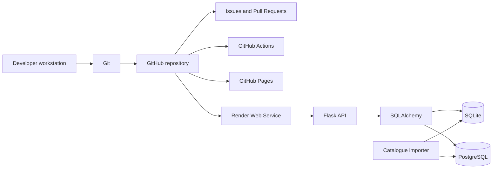

# Development Toolchain and Dependency Governance

**Project:** Smart Digital Product Recommendation Platform  
**Document owner:** Chu Junjie — project coordination and consolidated technical writing  
**Authoritative implementation branch:** `feature/product-database`  
**Recorded implementation baseline:** `7c406515bd4b657372fe519869596825cdf91d56`  
**Tracking:** Issue #55  
**Status:** Draft — technical-owner review pending

## 1. Purpose

This document defines the project's development toolchain, runtime dependencies, collaboration workflow, test environment, data tooling and deployment responsibilities.

It records what each tool is used for, why it was selected, which evidence currently exists, and which decisions remain open. It does not claim that an installation, deployment, database environment or test suite is successful unless a named result has been retained.

## 2. Toolchain overview



## 3. Collaboration and source-control tools

### 3.1 Git

Git provides local version history, branch isolation, commit-level traceability and controlled integration.

Project rules:

- no direct implementation changes to another owner's component;
- one clearly scoped branch per work item;
- meaningful commit messages using prefixes such as `docs:`, `test:`, `ci:`, `fix:` and `feature:`;
- no force update of shared branches without an explicit team decision;
- release integration must preserve a named source commit and review record.

### 3.2 GitHub Issues

Issues are used to record:

- purpose and scope;
- ownership;
- acceptance or completion conditions;
- evidence boundaries;
- blockers and dependencies;
- links to related Pull Requests and verification records.

An Issue is a coordination record. Creating an Issue does not prove that the work has been implemented or verified.

### 3.3 GitHub branches and Pull Requests

The expected workflow is:

1. create an Issue;
2. create a branch from the approved baseline;
3. make only the scoped changes;
4. run applicable checks;
5. open a Draft Pull Request;
6. obtain owner-specific review;
7. resolve review comments;
8. merge only after the relevant gates pass.

Draft Pull Requests are used to expose incomplete work without representing it as ready to merge.

### 3.4 Review ownership

| Area | Primary technical owner | Coordinator responsibility |
|---|---|---|
| Frontend and interface | Guanyu | Track evidence and review gates |
| Backend, API, recommendation and tests | Zaikun | Track CI, blockers and release status |
| Database, catalogue, importer and provenance | Yuyang | Track verification and persistence evidence |
| Governance, release records and cross-component coordination | Junjie | Author and maintain coordination documents |

## 4. Runtime platform

### 4.1 Python

The backend is implemented in Python. GitHub Actions PR #35 uses Python 3.11 for reproducible CI execution.

The final supported local-development version must be confirmed by the backend owner and documented consistently in local setup, CI and deployment records.

Recommended version check:

```bash
python --version
```

This command records the interpreter identity; it does not validate the application.

### 4.2 Current runtime dependency manifest

The current `requirements.txt` contains:

```text
Flask>=3.0,<4.0
Flask-Cors>=4.0,<7.0
gunicorn>=22,<24
PyJWT>=2.8,<3.0
SQLAlchemy>=2.0,<3.0
psycopg[binary]>=3.1,<4.0
```

| Dependency | Responsibility | Reason for selection | Owner confirmation |
|---|---|---|---|
| Flask | REST API, routing and JSON responses | Lightweight HTTP application framework | Zaikun |
| Flask-Cors | Browser-origin access policy | Supports separated frontend and API hosting | Zaikun and Guanyu |
| Gunicorn | Production WSGI process | Suitable for hosted Flask execution | Zaikun |
| PyJWT | JWT issue and validation | Stateless API authentication | Zaikun |
| SQLAlchemy | Database schema and queries | Shared SQLite and PostgreSQL data-access layer | Zaikun and Yuyang |
| psycopg | PostgreSQL driver | Connects SQLAlchemy to PostgreSQL | Yuyang and Zaikun |

Dependency ranges are bounded by major versions to reduce unplanned breaking changes while allowing compatible updates.

### 4.3 Dependency installation

Typical installation command:

```bash
python -m pip install -r requirements.txt
```

Recommended environment checks:

```bash
python -m pip --version
python -m pip check
```

A command appearing in this document is an operating procedure, not a claim that it passed in every environment.

## 5. Backend and API tools

### 5.1 Flask

Flask provides:

- application routing;
- request parsing;
- JSON responses;
- error handling;
- registration, login and profile endpoints;
- recommendation, comparison, favorites, history and feedback endpoints.

The API contract must be reviewed together with `server.py`, `api-contract.md` and the current tests.

### 5.2 Flask-Cors

The frontend and backend are hosted separately. Flask-Cors restricts browser calls to configured GitHub Pages and local-development origins.

Required verification:

- intended production origin is present;
- unintended origins are rejected where expected;
- required methods and headers work;
- no authentication secret is exposed through CORS configuration.

### 5.3 Gunicorn

Gunicorn is the production process declared for hosted Flask execution. The exact Render start command and deployed process configuration remain part of deployment verification.

### 5.4 PyJWT and password hashing

JWTs carry authenticated user identity between the browser and API. Passwords are hashed using Werkzeug security helpers before storage.

Operational controls:

- `JWT_SECRET_KEY` must be provided through secure environment configuration;
- production secrets must not use the local fallback value;
- tokens, passwords and connection strings must not appear in screenshots or retained logs;
- logout and token-expiry behaviour require deployed browser verification.

## 6. Database and data tools

### 6.1 SQLAlchemy Core

SQLAlchemy defines tables and executes database operations for both SQLite and PostgreSQL.

Benefits:

- shared schema definitions;
- explicit transactions;
- portable query construction;
- reduced database-specific duplication;
- test-time database substitution through configuration.

Portability does not prove that both engines behave identically. PostgreSQL-specific verification remains required.

### 6.2 SQLite

SQLite is used for bundled local demonstration and seed data.

Appropriate uses:

- local startup without a separate database service;
- bundled catalogue demonstration;
- isolated test databases where fixtures configure a temporary URL.

Known control requirement:

- tests must not modify the tracked `digital_products.db` file;
- test-generated databases should be temporary and isolated;
- local SQLite results must not be presented as PostgreSQL persistence evidence.

### 6.3 PostgreSQL and psycopg

When `DATABASE_URL` is configured, the API converts supported PostgreSQL URLs for the psycopg SQLAlchemy driver.

Required release evidence includes:

- deployed engine identity;
- schema creation;
- product and specification counts;
- importer result;
- account, favorites, history and feedback persistence;
- behaviour after restart or redeployment;
- backup and recovery approach.

This work is tracked under Issue #41 and PR #48.

### 6.4 Catalogue importer

`import_real_catalog.py` is responsible for preparing recommendation-ready catalogue records and provenance fields.

Verification should record:

- input files and source metadata;
- exact command and commit;
- first-run counts;
- second-run counts;
- duplicate and orphan checks;
- rollback or restoration procedure;
- historical-price and currency limitations.

The importer and dataset remain Yuyang-owned components.

## 7. Frontend tools

### 7.1 HTML, CSS and JavaScript

The frontend is a static single-page interface implemented in `index.html`.

Responsibilities include:

- preference input;
- registration and login;
- recommendation requests;
- Top 5 and paginated result rendering;
- comparison;
- favorites and history;
- feedback and share state;
- loading, empty and error states;
- responsive layout and accessibility attributes.

No separate frontend package manager or compilation pipeline is currently recorded on the V3 baseline. Guanyu should confirm whether any additional local tooling was used and should be retained in this document.

### 7.2 Browser developer tools

Browser developer tools are appropriate for:

- Console error inspection;
- Network request and response verification;
- responsive viewport checks;
- storage and token inspection without retaining secrets;
- accessibility inspection;
- cache and deployment-identity checks.

Executed browser evidence must record browser version, device or viewport, commit, environment and observed result.

## 8. Testing tools

### 8.1 pytest

pytest is used as the Python test runner. It is not currently listed in the runtime `requirements.txt`; PR #35 installs it separately inside CI.

Current evidence boundary:

- the V3 `test_server.py` subset passed 12 tests in the recorded CI run;
- the complete repository suite collected 18 tests and failed 6 legacy `test_mock.py` tests;
- the canonical final suite and dependency strategy remain pending Zaikun's decision under Issue #34.

Commands used by the CI design:

```bash
python -m pytest --collect-only -q test_server.py
python -m pytest -q test_server.py
python -m pytest --collect-only -q
python -m pytest -q
```

The full-suite command must not be documented as a green release check until an actual successful run exists.

### 8.2 Test isolation

Expected controls:

- temporary database for tests;
- no tracked-file mutation;
- deterministic seed data;
- isolated user data;
- negative authentication and privacy tests;
- explicit cleanup after execution.

### 8.3 Test dependency decision

The backend/test owner must select one supported strategy:

1. add test tools to a separate development requirements file;
2. retain documented CI-only installation;
3. use another explicit and reviewed dependency mechanism.

Local and CI instructions should use the same approved strategy.

## 9. Continuous integration

### 9.1 GitHub Actions

PR #35 proposes `.github/workflows/tests.yml` with two jobs:

- V3 API suite for `test_server.py`;
- complete repository audit without silently excluding legacy tests.

Workflow controls include:

- Ubuntu runner;
- Python 3.11;
- runtime dependency installation;
- separate pytest installation;
- environment and commit recording;
- test collection before execution;
- tracked-file integrity check;
- concurrency cancellation for superseded runs.

The workflow remains Draft and must not be merged as a complete green-suite claim while the full audit fails.

## 10. Deployment tools

### 10.1 GitHub Pages

GitHub Pages is the candidate static frontend host.

Required confirmation:

- configured source branch and folder;
- exact deployed commit;
- cache or deployment delay;
- current V3 flows present on the live page;
- correct Render API target.

These items remain tracked under Issue #42.

### 10.2 Render

Render is the candidate Flask API host.

Required confirmation:

- deployed commit;
- build and start commands;
- environment-variable names without secret values;
- health endpoint;
- database engine;
- restart and redeployment behaviour;
- service limitations and rollback procedure.

### 10.3 Managed PostgreSQL

The production target requires PostgreSQL persistence rather than the bundled SQLite fallback.

A configured `DATABASE_URL` is implementation configuration. It is not evidence that production is using PostgreSQL until the deployed API and safe engine evidence confirm it.

## 11. Architecture and interface-design tools

Version-controlled Mermaid diagrams are used in Markdown for reviewable architecture, sequence and entity-relationship diagrams.

External editable artifact register:

| Artifact | Tool | Owner | Status | Link |
|---|---|---|---|---|
| Component/deployment diagram | Pending team selection | Zaikun, Guanyu and Yuyang | Pending | Pending |
| Database ERD | Pending Yuyang confirmation | Yuyang | Pending | Pending |
| Desktop/mobile prototype | Pending Guanyu confirmation | Guanyu | Pending | Pending |

No external tool should be listed as used until a real team-owned artifact or retained workflow confirms it.

## 12. Environment variables and secrets

| Variable | Purpose | Allowed evidence |
|---|---|---|
| `DATABASE_URL` | Select PostgreSQL production database | Presence, masked engine and safe configuration status |
| `JWT_SECRET_KEY` | Sign and validate JWTs | Presence and rotation policy; never the value |
| Platform-provided variables | Hosting configuration | Variable names and non-sensitive behaviour only |

Controls:

- never commit `.env` secrets;
- never paste complete connection strings into Issues or logs;
- redact credentials in screenshots;
- rotate a secret if exposure is suspected;
- separate local placeholders from production values.

## 13. Repeatable local procedure

The following procedure is a documented workflow and requires execution evidence before it is treated as successful for a release candidate.

```bash
git checkout feature/product-database
git pull --ff-only
python -m venv .venv
```

Activate the virtual environment using the operating-system-specific command, then run:

```bash
python -m pip install --upgrade pip
python -m pip install -r requirements.txt
python -m pip check
```

Start the API using the backend-owner-approved command. A common local Flask procedure may be:

```bash
python server.py
```

Serve the static frontend using an approved local web server, then verify that its configured local API URL reaches the running Flask service.

The final canonical startup commands require technical-owner confirmation.

## 14. Validation checklist

### Repository

- [ ] working tree is clean before execution;
- [ ] branch and commit are recorded;
- [ ] no teammate-owned file is changed unexpectedly;
- [ ] generated files are excluded or restored.

### Dependencies

- [ ] Python version recorded;
- [ ] pip version recorded;
- [ ] runtime requirements installed;
- [ ] `pip check` result retained;
- [ ] test-dependency strategy confirmed.

### Application

- [ ] API starts using the intended database engine;
- [ ] frontend loads from the intended source;
- [ ] CORS permits intended requests;
- [ ] secrets are not exposed.

### Testing

- [ ] canonical collection command retained;
- [ ] canonical suite passes;
- [ ] tracked-file integrity passes;
- [ ] database isolation confirmed.

### Deployment

- [ ] frontend commit confirmed;
- [ ] API commit confirmed;
- [ ] PostgreSQL engine confirmed;
- [ ] persistence verified;
- [ ] rollback method recorded.

## 15. Dependency governance

### Adding a dependency

A new dependency should include:

- a linked Issue explaining the need;
- comparison with built-in or existing alternatives;
- version range and compatibility rationale;
- security and maintenance considerations;
- installation and test evidence;
- owner review;
- updated setup documentation.

### Updating a dependency

Before changing a version range:

- inspect release notes and breaking changes;
- execute the canonical test suite;
- verify deployment compatibility where relevant;
- record the tested commit and environment;
- avoid unrelated dependency upgrades in the same PR.

### Removing a dependency

Removal requires confirmation that:

- no source or deployment file still imports or invokes it;
- tests and deployment still pass;
- documentation and manifests are updated together.

## 16. Known open decisions

| Decision | Owner | Tracking |
|---|---|---|
| Final canonical test suite | Zaikun | Issue #34 |
| `test_mock.py` update, archive or exclusion | Zaikun | Issue #34 |
| Test dependency location | Zaikun | Issue #34 / PR #35 |
| Deployed frontend source and commit | Guanyu | Issue #42 |
| Deployed API commit and start command | Zaikun | Issue #42 |
| PostgreSQL engine, persistence and backup | Yuyang | Issue #41 / PR #48 |
| External architecture and interface artifact tools | Technical owners | Issue #51 / PR #52 |
| Safe integration into `main` | All owners | Issue #43 / PR #44 |

## 17. Review responsibilities

### Zaikun

- confirm Python, Flask, Gunicorn, JWT and backend dependency descriptions;
- confirm pytest, CI and canonical-command wording;
- confirm Render API operational descriptions;
- identify unsupported runtime or security claims.

### Yuyang

- confirm SQLite, PostgreSQL, SQLAlchemy and psycopg descriptions;
- confirm importer and provenance tooling;
- confirm backup, persistence and recovery wording;
- identify unsupported data claims.

### Guanyu

- confirm static frontend and browser-tool descriptions;
- confirm GitHub Pages workflow;
- confirm interface-design and prototype-tool records;
- identify unsupported deployment claims.

### Junjie

- maintain one consistent toolchain reference;
- keep runtime, test and deployment evidence separate;
- link decisions and verification records;
- avoid changes to teammate-owned implementation.

## 18. Current conclusion

The project uses a modern, reviewable toolchain built around GitHub, Python, Flask, SQLAlchemy, SQLite/PostgreSQL, static browser technologies and automated CI. The remaining work is not to add unverified tool claims, but to complete owner confirmation, standardise dependency and test procedures, verify the deployed environments and retain repeatable operational evidence.