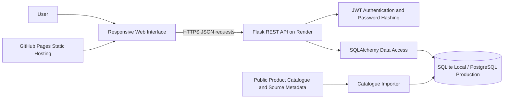
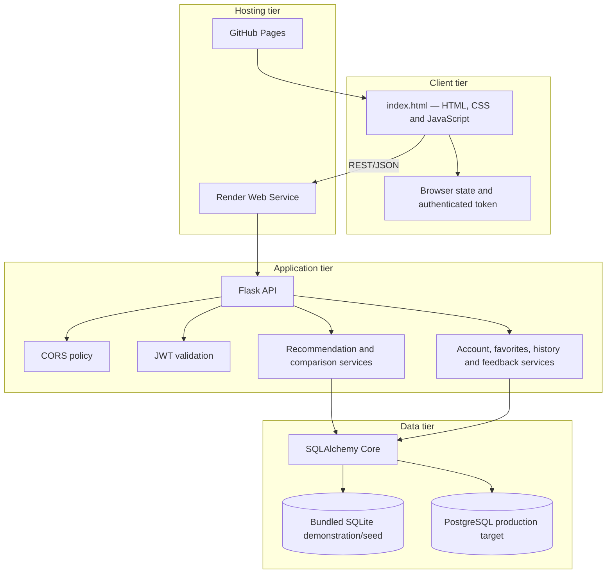
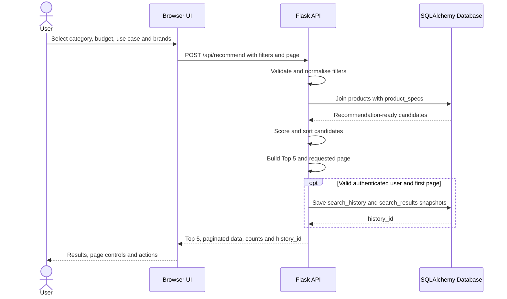
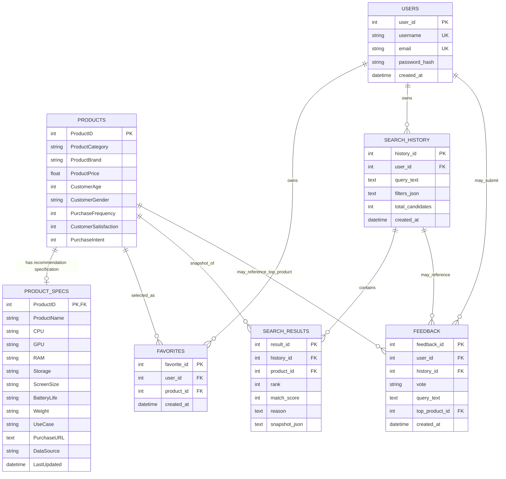
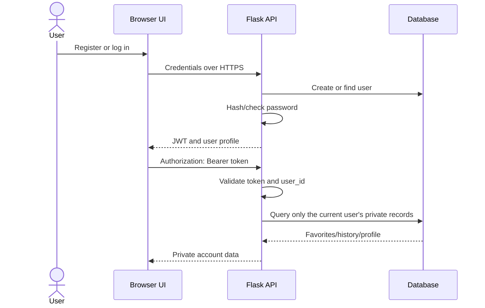
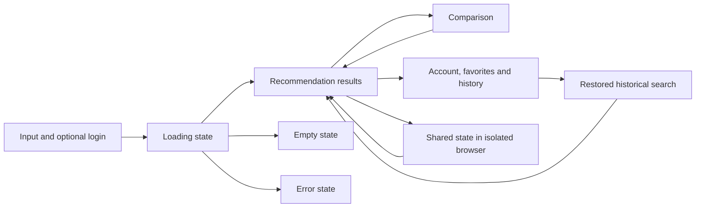

# V3 Design and Architecture

**Project:** Smart Digital Product Recommendation Platform  
**Document owner:** Chu Junjie — project coordination and consolidated technical writing  
**Authoritative implementation branch:** `feature/product-database`  
**Recorded implementation baseline:** `7c406515bd4b657372fe519869596825cdf91d56`  
**Tracking:** Issue #51  
**Status:** Draft — technical-owner review and external diagram links pending

## 1. Purpose

This page explains the major V3 architecture, database and interface design decisions in one reviewable location. It is intended to help assessors and team members understand how the current frontend, API, recommendation logic, catalogue, account features and persistence model fit together.

The descriptions below are derived from the current repository implementation. They are not claims that the deployed frontend, deployed API, PostgreSQL persistence, browser E2E or external acceptance testing have passed.

## 2. Evidence vocabulary

| Status | Meaning in this document |
|---|---|
| Implemented | The structure or behaviour exists in the recorded branch. |
| Prepared | A diagram, template or verification method exists but has not been executed or approved. |
| Verified | A named check passed for a named commit and environment. |
| Unverified | Repository configuration exists, but the deployed environment or result has not been confirmed. |
| Not Run | The relevant test or acceptance activity has not been executed. |
| Pending review | The responsible technical owner has not yet confirmed the description. |

## 3. Required external design artifacts

The repository contains version-controlled Mermaid diagrams so architecture changes can be reviewed through Git. For strict rubric alignment, the final submission must also retain editable online design artifacts.

| Artifact | Required scope | Responsible confirmation | Current status | Final link |
|---|---|---|---|---|
| UML/component and deployment diagram | Browser, GitHub Pages, Flask API, authentication, importer and database boundaries | Zaikun + Guanyu + Yuyang | Pending | Pending |
| Database ERD | Tables, keys, relationships, cardinality and delete behaviour | Yuyang | Pending | Pending |
| Desktop and mobile UI prototype | Input, results, account/history, favorites and comparison views | Guanyu | Pending | Pending |

A placeholder must not be replaced with a fabricated link. Each final link must open an editable or clearly inspectable artifact used by the team.

## 4. System context

The platform helps a user choose a digital product by submitting structured preferences such as product type, maximum budget, main use, preferred brand and excluded brand. The browser calls a Flask REST API, which joins behavioural product data with recommendation-ready product specifications, ranks matching candidates and returns paginated recommendations plus a separate Top 5.

A user may search anonymously. Registration and login add private favorites, search history, saved recommendation snapshots and account-linked feedback.

### 4.1 System boundary

Inside the project boundary:

- the responsive browser UI;
- request validation and API responses;
- recommendation filtering, scoring and pagination;
- account registration and authentication;
- favorites, search history, snapshots and feedback;
- catalogue import and provenance fields;
- SQLite local storage and PostgreSQL production support.

Outside the project boundary:

- GitHub Pages availability;
- Render availability and configuration;
- PostgreSQL hosting and backup facilities;
- accuracy and continuing availability of external product-source pages;
- live retail inventory and live prices.

The catalogue prices are educational historical snapshots, not guaranteed live retail prices. Product links may be manufacturer or reference pages rather than checkout pages.

## 5. Deployment architecture

### 5.1 Current deployment evidence boundary

Repository configuration identifies:

- a GitHub Pages frontend URL;
- a Render API base URL;
- `DATABASE_URL` support for PostgreSQL;
- SQLite fallback for local use.

The following remain unverified until Issue #41 and Issue #42 retain executed evidence:

- exact commit currently served by GitHub Pages;
- exact commit currently served by Render;
- production database engine in the deployed API;
- persistence across service restart or redeployment;
- complete browser-to-API E2E behaviour.

## 6. Component responsibilities

| Component | Main responsibility | Current implementation source | Technical owner |
|---|---|---|---|
| Browser interface | Collect preferences, show Top 5 and pages, account/history/favorites, compare, feedback and share state | `index.html` | Guanyu |
| Flask API | Validate requests, expose REST endpoints, enforce authentication and return JSON contracts | `server.py` | Zaikun |
| Recommendation service | Filter joined catalogue records, calculate match scores, sort results and paginate | `server.py` | Zaikun |
| Account and privacy service | Password hashing, JWT issue/validation and user-scoped private data | `server.py` | Zaikun |
| Database schema | Products, specifications, users, favorites, history, snapshots and feedback | `server.py` SQLAlchemy tables | Yuyang confirms data design; Zaikun confirms API usage |
| Catalogue importer | Import recommendation-ready public catalogue records and provenance metadata | `import_real_catalog.py` | Yuyang |
| Local seed/demonstration data | Provide bundled SQLite product and specification seed | `digital_products.db` | Yuyang |
| Production persistence | Use PostgreSQL when `DATABASE_URL` is configured | Render/PostgreSQL configuration | Yuyang with Zaikun deployment coordination |
| Governance and release evidence | Traceability, Definition of Done, review gates, acceptance and release records | `docs/` | Junjie |

## 7. API design

The API uses JSON request and response bodies and separates public recommendation functions from authenticated private functions.

### 7.1 Main endpoint groups

| Endpoint group | Purpose | Authentication boundary |
|---|---|---|
| `/api/health` | Database and API health/count summary | Public |
| `/api/auth/register` | Create password-hashed account and return token | Public submission |
| `/api/auth/login` | Validate account credentials and return token | Public submission |
| `/api/auth/me` | Return the authenticated profile | Required |
| `/api/recommend` | Return filters, Top 5, page results and optional history ID | Search public; saving history requires valid token |
| `/api/products` | Browse/filter products with pagination | Public |
| `/api/compare` | Compare supported ProductIDs | Public in current contract |
| `/api/favorites` | List, add or remove private favorites | Required |
| `/api/history` | List, restore or delete private history/snapshots | Required |
| `/api/feedback` | Record recommendation feedback | May be linked to authenticated user/history where available |

Exact endpoint methods and final contracts must be confirmed by Zaikun during review.

### 7.2 Recommendation request flow

### 7.3 Ranking design

The current implementation applies a deterministic rule-based score rather than a black-box machine-learning model. The score considers:

- category match;
- preferred brand;
- budget compliance;
- use-case terms;
- customer satisfaction;
- purchase frequency;
- purchase intent.

Results are sorted first by descending match score and then by ascending price. This design is explainable and suitable for a course project because the API can return a human-readable reason for each recommendation.

Limitations:

- score weights require owner confirmation and acceptance evidence;
- behavioural fields may not represent current market preference;
- the result is not a guarantee of product suitability;
- US-09 budget-alternative scope remains pending under Issue #40.

## 8. Database design

### 8.1 Entity relationship model

### 8.2 Relationship rationale

**Products and product specifications**

`products` retains behavioural and basic commercial attributes. `product_specs` retains recommendation-ready descriptive specifications and provenance. Joining on `ProductID` prevents a recommendation card from depending on a product that lacks the required display fields.

**Users and favorites**

A unique user/product constraint prevents duplicate favorite records. Favorites belong to a user, supporting private account views and repeat comparison.

**Search history and result snapshots**

`search_history` stores the original query and filters. `search_results` stores the ranked result snapshot and reason shown at search time. This allows a user to reopen an earlier search without silently replacing the historical result with a newly calculated catalogue state.

**Feedback**

Feedback can reference the user, search and top product when available. Nullable references allow retained feedback without forcing all public searches to create an account.

### 8.3 Delete and privacy behaviour

The current schema describes the following intended boundaries:

- deleting a user cascades to their favorites and search history;
- deleting search history cascades to its saved result snapshots;
- feedback may retain a record while user/history/product references are set to null where configured;
- private favorites and history are accessed through authenticated user context;
- product/specification records are shared catalogue data, not private user data.

Yuyang and Zaikun must confirm actual PostgreSQL delete behaviour and API isolation through review and executed tests.

### 8.4 Database portability

SQLAlchemy is used to support two database contexts:

- SQLite for bundled local demonstration and seed data;
- PostgreSQL for production persistence when `DATABASE_URL` is configured.

This reduces database-specific query duplication. Portability is not the same as production verification; PostgreSQL engine identity, schema creation, data import and restart persistence remain part of Issue #41.

## 9. Authentication and privacy design

### 9.1 Security choices

- passwords are stored as hashes rather than plain text;
- authenticated requests use signed JWTs;
- the API reads its production secret from environment configuration;
- CORS allows the intended frontend origins and local-development origins;
- database credentials are expected through environment configuration, not repository source;
- screenshots and evidence must not retain passwords, tokens, cookies or connection strings.

### 9.2 Known security limitations requiring verification

- no production secret-strength evidence is currently retained;
- token storage and logout behaviour require deployed browser review;
- cross-user favorites/history access requires explicit negative tests;
- rate limiting, email verification and password reset are not confirmed current scope;
- HTTPS termination and PostgreSQL backup controls depend on hosting configuration.

## 10. Interface design

### 10.1 Information architecture

The current single-page interface is organised into four main views:

1. **Account and preference input**
   - register/login controls;
   - product type, budget, use case, preferred brand and excluded brand;
   - loading, validation, error and empty states.

2. **Recommendation results**
   - query summary;
   - separate Top Recommendations presentation;
   - product cards and pagination;
   - favorite selection;
   - compare, share and feedback actions.

3. **Account view**
   - profile details;
   - favorite products grouped for supported comparison;
   - search-history records with reopen/delete actions.

4. **Comparison view**
   - database-backed table for two or three selected products;
   - return navigation to recommendations or account context.

### 10.2 Responsive design

The interface includes a mobile breakpoint at 760px. On smaller viewports:

- the page padding and panel padding reduce;
- section headers become vertical;
- preference fields become a single column;
- product-card content reflows;
- utility and comparison actions expand to available width.

The final design package must include actual desktop and mobile prototype/screenshots and executed mobile-browser evidence. The presence of responsive CSS alone is not acceptance evidence.

### 10.3 Accessibility design

Current implementation includes:

- semantic section headings;
- explicit labels for major form controls;
- `aria-live` status regions for authentication, loading, errors, results, feedback and share messages;
- alert roles for blocking errors;
- a screen-reader-only utility class;
- visible focus styling on the main input;
- readable text and control sizing;
- viewport-responsive layout.

Still requiring executed review:

- full keyboard navigation;
- visible focus for every interactive control;
- accessible names for dynamically generated cards/actions;
- contrast verification;
- zoom and text-resizing behaviour;
- screen-reader reading order;
- mobile touch-target adequacy.

## 11. Major design decisions and justification

| Decision | Selected approach | Justification | Alternative considered | Limitation / evidence needed |
|---|---|---|---|---|
| Frontend delivery | Static HTML/CSS/JavaScript on GitHub Pages | Low hosting complexity and independent frontend deployment | Server-rendered Flask templates or framework SPA | Deployed commit identity remains unverified |
| API architecture | REST-style Flask JSON API | Clear separation, easy browser integration and testable endpoints | Monolithic server-rendered application | Requires contract and E2E evidence |
| Database access | SQLAlchemy Core | Shared schema/query layer for SQLite and PostgreSQL | Raw SQLite queries or database-specific code | Production PostgreSQL still requires verification |
| Authentication | Password hashing plus JWT | Supports stateless API authentication across separate hosting origins | Server-side sessions | Token handling and secret configuration need deployed review |
| Recommendation | Deterministic weighted scoring | Explainable reasons and reproducible output | Black-box ML model | Weight quality and acceptance require testing |
| Result presentation | Separate Top 5 plus paginated full results | Highlights best matches without preventing broader exploration | Top 5 only or unpaginated list | Top 5/page consistency requires E2E checks |
| History | Query record plus result snapshots | Restores what the user saw at the time | Re-run old filters against current catalogue | Storage growth and snapshot schema require review |
| Data structure | Separate product behaviour and specification tables | Preserves source roles and limits recommendation display to complete records | One denormalised product table | Join completeness and orphan checks required |
| Local/production database | SQLite local, PostgreSQL production | Easy local setup with modern production persistence | SQLite everywhere | Migration, backup and restart persistence evidence pending |
| Frontend packaging | One `index.html` prototype | Simple deployment and review for the current course scope | Modular JS/CSS build system | File size and maintainability may require future modularisation |

## 12. Non-functional design considerations

### 12.1 Maintainability

- component responsibilities are separated conceptually between frontend, API, importer and database;
- SQLAlchemy centralises table definitions;
- API responses use a consistent JSON status/error approach;
- governance, evidence and acceptance are version controlled.

Risk: the frontend and backend are currently large single files. Future development may separate UI components, API routes, services, schema definitions and configuration.

### 12.2 Reliability

- database connections use pre-ping support;
- table creation and seed loading are automated by setup logic;
- recommendation results are deterministic for the same data and filters;
- history snapshots preserve past displayed results.

Risk: automated startup import, hosting free-tier sleep, deployment identity and recovery procedures require retained evidence.

### 12.3 Performance

- recommendation page size defaults to 20 and is capped at 100;
- Top 5 is calculated separately from page display;
- database inserts are batched during seed setup.

Risk: current recommendation scoring may retrieve and score all joined matching rows in application memory. Performance with the full catalogue and concurrent users has not been load tested.

### 12.4 Data quality and transparency

- `DataSource` and `LastUpdated` fields support provenance;
- health and UI wording distinguish historical educational price data from live retail information;
- joined recommendation candidates are limited to products with specifications.

Risk: licence, retrieval date, currency conversion, required-field completeness and importer repeatability remain part of database release verification.

### 12.5 Portability

- the browser UI does not require installation;
- the API uses portable Python dependencies;
- SQLAlchemy supports local and production database targets;
- environment variables separate configuration from code.

Risk: exact deployment configuration and platform-specific limits must be documented by the responsible owners.

## 13. Design traceability to user-facing flows

| User-facing capability | Main UI component | Main API/data component | Verification dependency |
|---|---|---|---|
| Register/login | Account panel | users table, auth endpoints, JWT | Unit/API tests + deployed auth E2E |
| Request recommendation | Preference form | recommend endpoint, joined products/specs, scoring | API tests + result acceptance |
| View Top 5 and pages | Results view and pagination | `top_recommendations`, page metadata | Pagination E2E |
| Compare products | Selection controls and comparison table | compare endpoint and specifications | API + browser E2E |
| Save favorite | Product action/account view | favorites table and authenticated endpoint | Privacy E2E |
| Reopen search | History account view | search_history and search_results snapshots | Persistence + restore E2E |
| Submit feedback | Feedback panel | feedback table and endpoint | API/database verification |
| Share result state | Share action and URL restoration | Frontend state/URL handling plus public recommendation | Isolated-browser E2E |
| Use mobile/keyboard | Responsive layout and semantic controls | Frontend behaviour | Accessibility/mobile evidence |

## 14. Design risks and mitigations

| Risk | Impact | Current mitigation | Remaining action |
|---|---|---|---|
| Frontend/API deployments serve different commits | Invalid E2E and release claims | Record exact environment identity before testing | Issue #42 |
| PostgreSQL is configured incorrectly or not persistent | Account data may be lost | `DATABASE_URL` abstraction and verification record | Issue #41 / PR #48 |
| Legacy tests do not match V3 contracts | Full CI remains red | Preserve full-suite failure and require owner decision | Issue #34 / PR #35 |
| Old and new architecture descriptions conflict | Assessor confusion | This consolidated V3 page and release audit | Owner review then documentation correction |
| Cross-user private data exposure | Privacy failure | User-linked tables and token-derived user context | Negative API/E2E tests |
| Historical price data is mistaken for live retail data | Misleading product information | Source and historical-price wording | UAT and final documentation review |
| Large single frontend/backend files | Maintenance difficulty | Clear component map and controlled PR ownership | Future modularisation decision |
| External design artifacts are missing | HD design criterion not fully evidenced | Version-controlled Mermaid diagrams | Retain real UML, ERD and prototype links |

## 15. Review checklist

### 15.1 Zaikun — backend/API owner

- [ ] Confirm endpoint groups and authentication boundaries.
- [ ] Confirm recommendation scoring and sorting description.
- [ ] Confirm comparison, history, favorites and feedback service responsibilities.
- [ ] Confirm security and testability limitations are not overstated.
- [ ] Identify any incorrect API or backend statement.

### 15.2 Yuyang — database/data owner

- [ ] Confirm all tables, keys and relationships.
- [ ] Confirm delete/cascade statements against SQLite and PostgreSQL behaviour.
- [ ] Confirm catalogue/importer/provenance description.
- [ ] Confirm SQLite seed and PostgreSQL production wording.
- [ ] Supply or approve the final editable ERD link.

### 15.3 Guanyu — frontend/UI owner

- [ ] Confirm all current views and navigation flows.
- [ ] Confirm responsive breakpoint and layout description.
- [ ] Confirm loading, empty, error, comparison, history, favorites and share states.
- [ ] Confirm accessibility statements and remaining limitations.
- [ ] Supply or approve desktop/mobile prototype links.

### 15.4 Junjie — coordinator

- [ ] Confirm every claim links to implementation or retained evidence.
- [ ] Keep deployment, persistence and E2E results unverified until executed.
- [ ] Add final external UML, ERD and prototype links only after confirmation.
- [ ] Resolve review comments without modifying teammate-owned implementation.
- [ ] Update the coordinated review package to include this PR.

## 16. Current acceptance status

| Area | Current status |
|---|---|
| Version-controlled architecture description | Prepared in this Draft PR |
| Backend/API technical-owner review | Pending |
| Database technical-owner review | Pending |
| Frontend technical-owner review | Pending |
| Editable online UML link | Pending |
| Editable online ERD link | Pending |
| Editable UI prototype link | Pending |
| PostgreSQL deployment/persistence verification | Unverified |
| Deployed frontend/API identity | Unverified |
| Browser E2E | Not Run |
| External UAT | Not Run |

## 17. Related evidence

- Issue #34 / PR #35 — CI and final test-scope blocker
- Issue #40 / PR #47 — US-09 scope decision
- Issue #41 / PR #48 — database and PostgreSQL verification record
- Issue #42 — deployed E2E acceptance
- Issue #43 / PR #44 — `main` and V3 reconciliation plan
- Issue #45 / PR #46 — release evidence index
- Issue #49 / PR #50 — coordinated team review package
- Issue #51 — this design documentation work

## 18. Non-authorisation statement

This design page does not authorise Junjie to modify frontend, backend, automated tests, datasets, database files, importers or deployment settings. Any technical correction discovered during review must be handled by the responsible owner through an owner-controlled Issue, branch, test and Pull Request.
