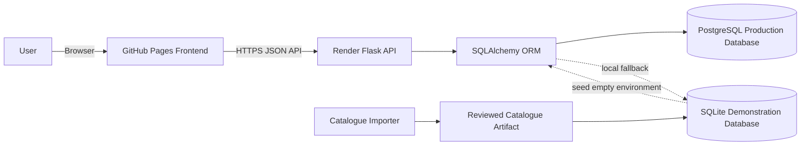
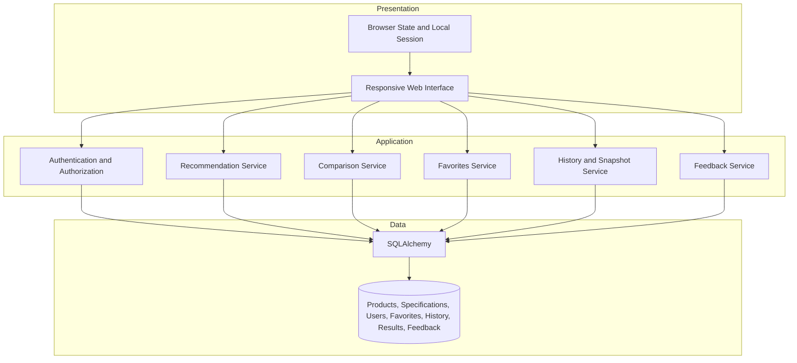
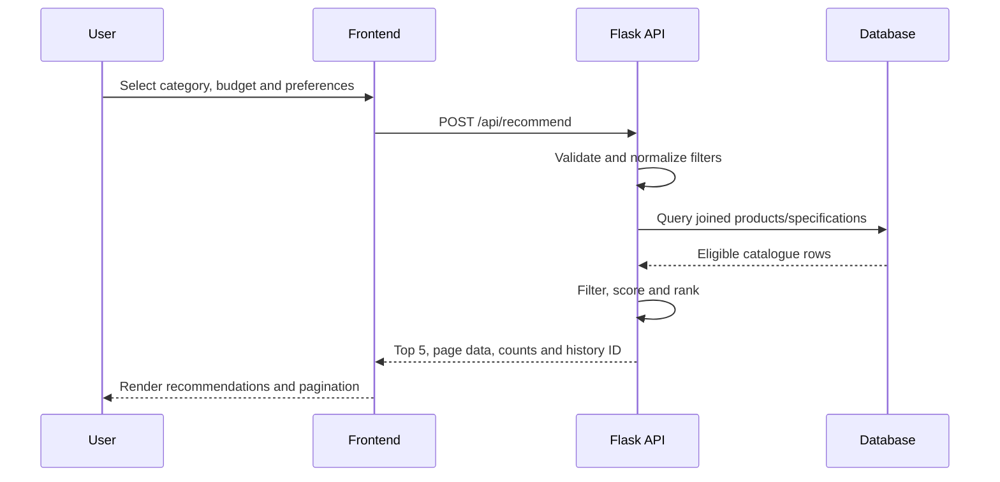
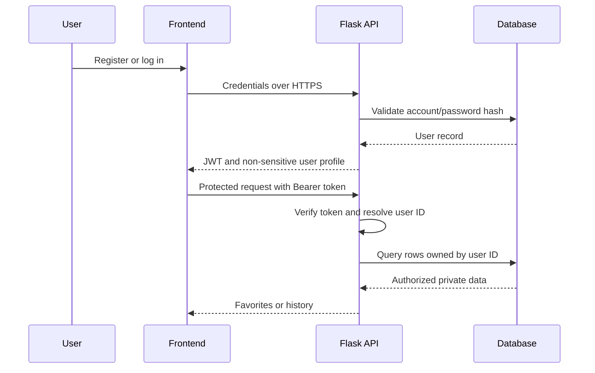
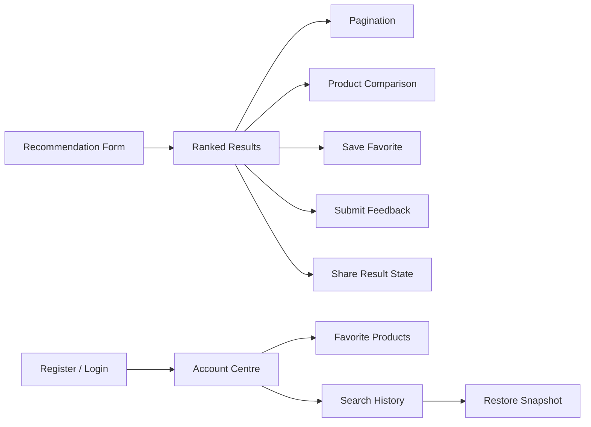
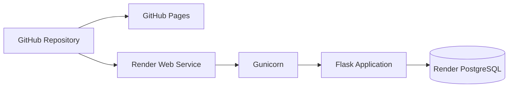

# V3 Design and Architecture

**Project:** Smart Digital Product Recommendation Platform  
**Authoritative implementation baseline:** `feature/product-database`  
**Record owner:** Chu Junjie — Project Manager and Release Coordinator  
**Status:** Prepared for formal component review

## 1. Purpose

This document records the current V3 system architecture, database structure, API boundaries, interface design and major engineering decisions. It provides one reviewable technical reference for the implemented release baseline.

The descriptions are derived from the current repository. Deployment, persistence and acceptance results remain separate runtime evidence.

## 2. System context



## 3. Component responsibilities

| Component | Responsibility |
|---|---|
| `index.html` | Responsive interface, authentication controls, recommendation filters, pagination, comparison, favorites, history, feedback and sharing |
| `server.py` | Flask API, request validation, JWT authentication, recommendation logic, persistence and error handling |
| SQLAlchemy | Database abstraction, schema definition, queries and transactions |
| PostgreSQL | Persistent production data for catalogue and user-owned records |
| SQLite | Bundled/local demonstration data and disposable catalogue verification |
| `import_real_catalog.py` | Public-catalogue construction, transformation, provenance and validation |
| `test_server.py` | Canonical V3 API and persistence-contract tests |
| GitHub Actions | Repeatable automated test evidence |
| GitHub Pages | Static frontend hosting |
| Render | Flask/Gunicorn service and managed PostgreSQL environment |

## 4. Logical architecture



## 5. API boundaries

| Area | Endpoint group | Main responsibility |
|---|---|---|
| Health | `/`, `/api/health` | Service status, API version, database dialect and counts |
| Authentication | `/api/auth/register`, `/api/auth/login`, `/api/auth/me` | Account creation, login and current identity |
| Recommendation | `/api/recommend`, `/api/products` | Filtering, scoring, Top 5 and pagination |
| Comparison | `/api/compare`, `/api/favorites/compare` | Compare 2–3 valid same-category products |
| Favorites | `/api/favorites`, `/api/favorites/<id>` | Private saved products |
| History | `/api/history`, `/api/history/<id>` | Private searches, snapshots and deletion |
| Feedback | `/api/feedback` | Store helpful/not-helpful responses |

Protected routes require a valid bearer token. User-owned queries include the authenticated user ID so one account cannot retrieve another account's private records through the normal API contract.

## 6. Recommendation design



The service applies structured filters, builds a ranked candidate list and returns both a separate Top 5 and paginated result data. Explanations and scores are generated from the active matching logic. Historical catalogue prices are presented for educational comparison and are not live retailer inventory.

US-09 Budget Alternatives is deferred. Budget filtering is supported, but the current contract does not provide a separately selected cheaper equivalent alternative.

## 7. Authentication and privacy design



Security controls include password hashing, JWT verification, authenticated ownership checks, no-store API responses and environment-based secret configuration. Production credentials must not be stored in source code or evidence.

## 8. Database design

```mermaid
erDiagram
    USERS ||--o{ FAVORITES : owns
    USERS ||--o{ SEARCH_HISTORY : creates
    USERS ||--o{ FEEDBACK : submits
    PRODUCTS ||--|| PRODUCT_SPECS : describes
    PRODUCTS ||--o{ FAVORITES : saved_as
    SEARCH_HISTORY ||--o{ SEARCH_RESULTS : contains
    SEARCH_HISTORY ||--o{ FEEDBACK : may_reference
    PRODUCTS ||--o{ SEARCH_RESULTS : captured_as
    PRODUCTS ||--o{ FEEDBACK : may_reference

    USERS {
        int user_id PK
        string username UK
        string email UK
        string password_hash
        datetime created_at
    }
    PRODUCTS {
        int ProductID PK
        string ProductName
        string ProductCategory
        decimal Price
        string Brand
    }
    PRODUCT_SPECS {
        int ProductID PK_FK
        string Processor
        string Memory
        string Storage
        string Display
        string Battery
        string DataSource
        string PurchaseURL
    }
    FAVORITES {
        int favorite_id PK
        int user_id FK
        int product_id FK
        datetime created_at
    }
    SEARCH_HISTORY {
        int history_id PK
        int user_id FK
        string query_text
        text filters_json
        int total_candidates
        datetime created_at
    }
    SEARCH_RESULTS {
        int result_id PK
        int history_id FK
        int product_id FK
        int rank
        decimal match_score
        text snapshot_json
    }
    FEEDBACK {
        int feedback_id PK
        int user_id FK
        int history_id FK
        string vote
        int top_product_id
        datetime created_at
    }
```

### Integrity decisions

- products and product specifications use ProductID as the join key;
- favorites enforce one user/product combination;
- search results are stored as snapshots so a historical search can be reopened consistently;
- history and favorites are scoped to the authenticated user;
- catalogue source metadata remains attached to product specifications;
- PostgreSQL is used for persistent production data while SQLite supports local and bundled demonstration use.

## 9. Catalogue design

The importer defines a 2,000-record public catalogue:

| Category | Rows |
|---|---:|
| Laptops | 800 |
| Smartphones | 833 |
| Smart Watches | 300 |
| Headphones | 61 |
| Tablets | 6 |

Missing specification values remain `Not specified` rather than being invented. Historical EUR and INR prices are converted using fixed documented rules. The importer must run only on a disposable build copy because its output-generation process clears private application tables.

## 10. Interface information architecture



### Main interface areas

- account and authentication panel;
- structured recommendation form;
- loading, error and empty states;
- Top Recommendations section;
- pagination controls;
- comparison and sharing controls;
- feedback panel;
- account centre with favorites and history;
- comparison table.

### Responsive and accessibility considerations

- single-column preference layout at narrow widths;
- horizontally scrollable comparison table;
- semantic labels and headings;
- `aria-live` status messages;
- keyboard-operable buttons and form controls;
- visible text for loading, empty and error conditions;
- responsive desktop/mobile verification required before release.

## 11. Deployment architecture



Expected service configuration:

- build command: `pip install -r requirements.txt`;
- start command: `gunicorn server:app`;
- `DATABASE_URL`: managed PostgreSQL connection supplied through environment configuration;
- `JWT_SECRET_KEY`: random secret supplied through environment configuration.

The deployment design is implemented in repository configuration and documentation, but the final deployed commit, database dialect and persistence behaviour require runtime evidence.

## 12. Key engineering decisions

| Decision | Rationale | Limitation/control |
|---|---|---|
| Static frontend plus JSON API | Simple deployment and clear separation | Requires correct CORS and API identity |
| SQLAlchemy | Supports SQLite and PostgreSQL with one data-access layer | Dialect behaviour must be verified |
| JWT authentication | Stateless API authorization | Token storage and expiry require security review |
| Search-result snapshots | Restores historical recommendations consistently | Snapshot storage increases database use |
| Public historical catalogue | Reproducible educational data | Not live price or stock information |
| Pagination plus separate Top 5 | Supports large result sets and quick decisions | UI and API must retain consistent filters |
| Deferred US-09 | Avoids ambiguous equivalent-product claims | Documented backlog item |

## 13. Non-functional considerations

### Reliability

- repeatable automated tests;
- database transactions;
- explicit API errors;
- tracked-file integrity check;
- release smoke test and rollback record.

### Security and privacy

- password hashing;
- JWT authorization;
- user-scoped queries;
- environment-based secrets;
- no credentials in screenshots or logs;
- cross-user deployed verification.

### Performance

- server-side filtering and pagination;
- maximum page-size controls;
- indexed primary and foreign keys;
- production PostgreSQL for persistent concurrent access.

### Maintainability

- clear component boundaries;
- documented API contract;
- centralized dependency manifest;
- version-controlled architecture and release records;
- owner-controlled technical changes.

## 14. Open verification items

- [ ] Formal backend/API review by Zaikun.
- [ ] Formal schema/catalogue review by Yuyang.
- [ ] Formal interface/accessibility review by Guanyu.
- [ ] Final deployed frontend and API commit identities.
- [ ] PostgreSQL persistence and privacy verification.
- [ ] Desktop/mobile browser E2E.
- [ ] External acceptance.
- [ ] Final release-candidate CI.

## 15. Review outcome

Reviewers should use one of the following outcomes:

- Approved;
- Approved with an accepted limitation;
- Changes requested with specific corrections.

This design record is ready for formal component review. Approval confirms that the document accurately describes the reviewed component; it does not replace required runtime verification.
