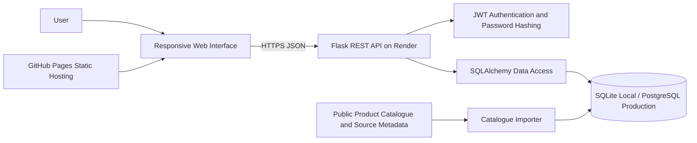
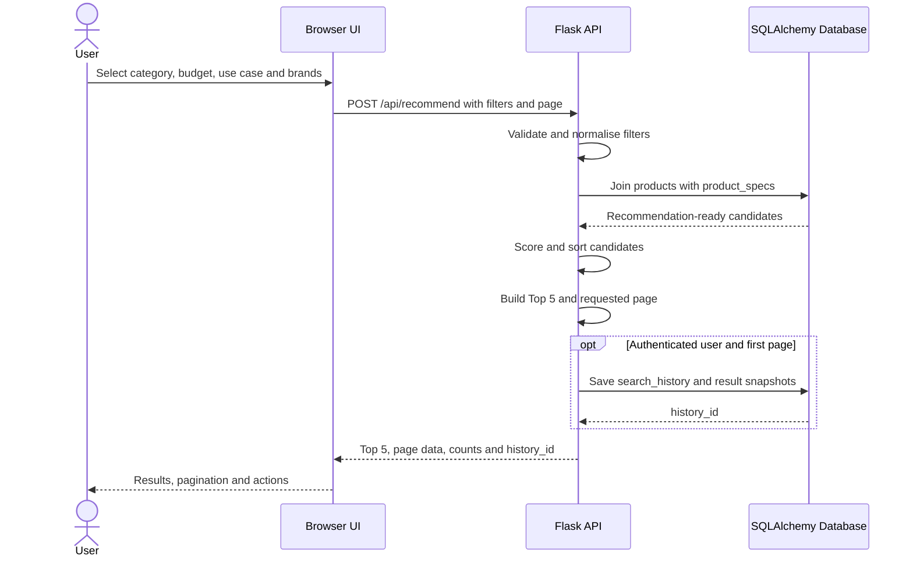
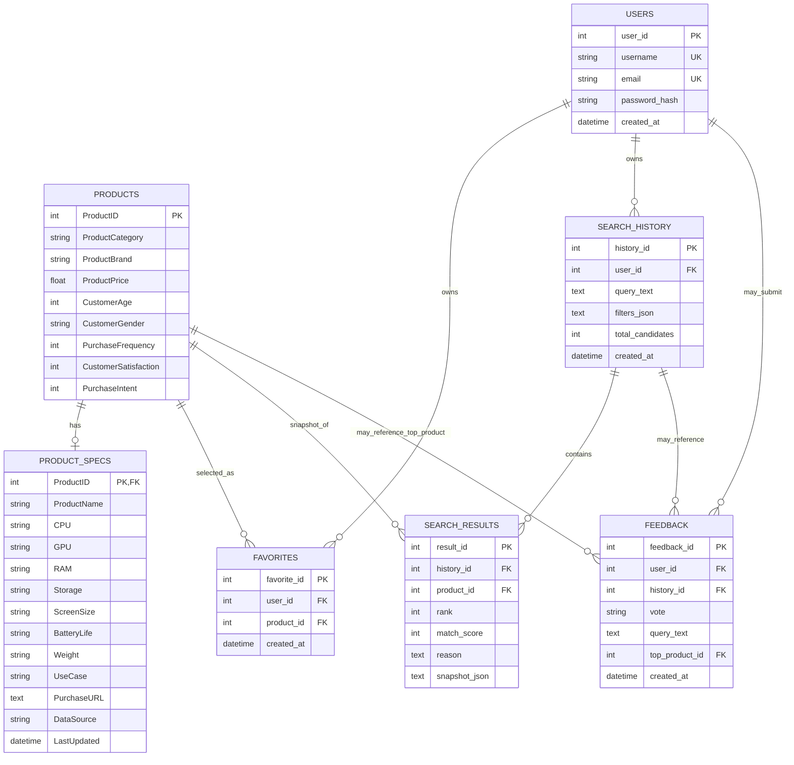
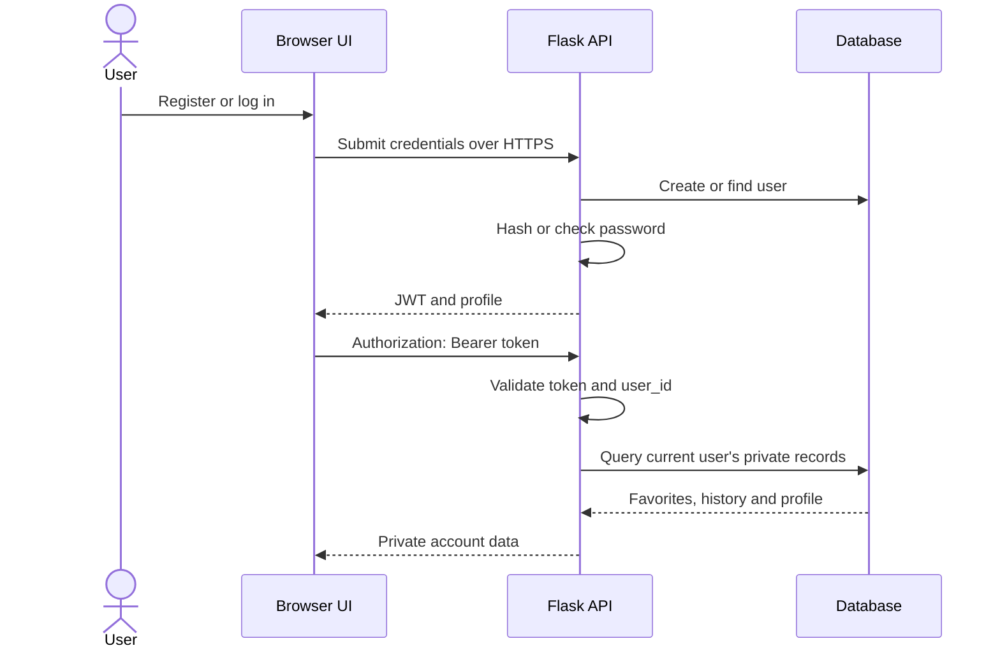
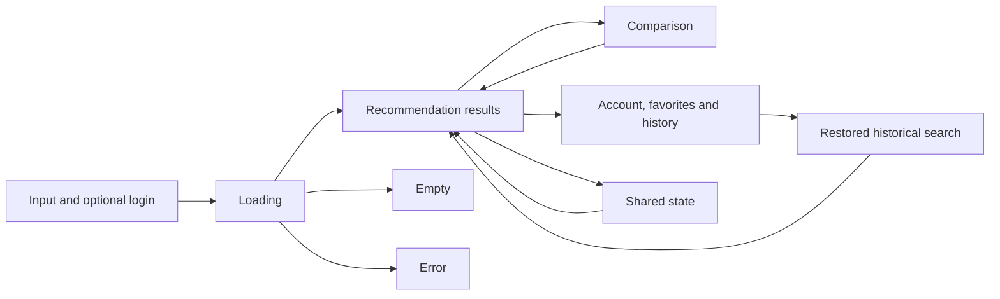

# V3 Design and Architecture

**Project:** Smart Digital Product Recommendation Platform  
**Document owner:** Chu Junjie — project coordination and consolidated technical writing  
**Authoritative implementation branch:** `feature/product-database`  
**Recorded implementation baseline:** `7c406515bd4b657372fe519869596825cdf91d56`  
**Tracking:** Issue #51  
**Status:** Draft — technical-owner review and external diagram links pending

## 1. Purpose

This document provides a single technical reference for the current V3 architecture, data model, API boundaries, user-interface structure and major design decisions.

The descriptions are derived from the recorded repository baseline. They do not prove that the deployed frontend, deployed API, PostgreSQL persistence, browser end-to-end flows or external acceptance activities have been verified.

## 2. Status vocabulary

| Status | Meaning |
|---|---|
| Implemented | The structure or behaviour exists in the recorded branch. |
| Prepared | A design, template or verification method exists but has not been executed or approved. |
| Verified | A named check passed for a named commit and environment. |
| Unverified | Repository configuration exists, but the deployed environment or result has not been confirmed. |
| Not Run | The relevant verification activity has not been executed. |
| Pending review | The responsible technical owner has not yet confirmed the description. |

## 3. Design artifact register

Version-controlled Mermaid diagrams are included so architecture changes can be reviewed through Git. Externally editable diagrams should be linked after the relevant owner confirms them.

| Artifact | Scope | Owner confirmation | Status | Link |
|---|---|---|---|---|
| Component and deployment diagram | Browser, GitHub Pages, Flask API, authentication, importer and database boundaries | Zaikun, Guanyu and Yuyang | Pending | Pending |
| Database ERD | Tables, keys, relationships, cardinality and delete behaviour | Yuyang | Pending | Pending |
| Desktop and mobile interface prototype | Input, results, account/history, favorites and comparison views | Guanyu | Pending | Pending |

A placeholder must not be replaced with an unverified or inaccessible link.

## 4. System context

The platform helps a user select a digital product by submitting structured preferences such as product type, maximum budget, main use, preferred brand and excluded brand.

The browser sends JSON requests to a Flask REST API. The API joins behavioural product data with recommendation-ready product specifications, applies deterministic filtering and scoring, then returns paginated results and a separate Top 5.

Users may search anonymously. Registration and login add private favorites, search history, saved result snapshots and account-linked feedback.

### 4.1 Project boundary

Inside the project boundary:

- responsive browser interface;
- request validation and API responses;
- recommendation filtering, scoring and pagination;
- registration and authentication;
- favorites, history, result snapshots and feedback;
- catalogue import and provenance fields;
- SQLite local storage and PostgreSQL production support.

Outside the project boundary:

- GitHub Pages service availability;
- Render service availability and configuration;
- managed PostgreSQL hosting and backup facilities;
- continuing availability of external product-source pages;
- live retail inventory and live prices.

Catalogue prices are historical educational snapshots and are not guaranteed live retail prices. Product links may point to manufacturer or reference pages rather than checkout pages.

## 5. Deployment architecture

### 5.1 Deployment evidence boundary

Repository configuration identifies a GitHub Pages frontend URL, a Render API base URL, PostgreSQL support through `DATABASE_URL`, and SQLite fallback for local use.

The following remain unverified until Issue #41 and Issue #42 retain executed evidence:

- exact commit served by GitHub Pages;
- exact commit served by Render;
- production database engine used by the deployed API;
- persistence across restart or redeployment;
- complete browser-to-API behaviour.

## 6. Component responsibilities

| Component | Responsibility | Implementation source | Technical owner |
|---|---|---|---|
| Browser interface | Collect preferences; display Top 5, pages, account/history/favorites, compare, feedback and share state | `index.html` | Guanyu |
| Flask API | Validate requests, expose endpoints, enforce authentication and return JSON contracts | `server.py` | Zaikun |
| Recommendation service | Filter joined records, calculate scores, sort and paginate results | `server.py` | Zaikun |
| Account and privacy service | Password hashing, JWT issue/validation and user-scoped private data | `server.py` | Zaikun |
| Database schema | Products, specifications, users, favorites, history, snapshots and feedback | SQLAlchemy tables in `server.py` | Yuyang confirms data design; Zaikun confirms API usage |
| Catalogue importer | Import recommendation-ready records and provenance metadata | `import_real_catalog.py` | Yuyang |
| Local seed data | Supply bundled SQLite products and specifications | `digital_products.db` | Yuyang |
| Production persistence | Use PostgreSQL when `DATABASE_URL` is configured | Render/PostgreSQL configuration | Yuyang with Zaikun deployment coordination |
| Governance and release evidence | Traceability, review gates, acceptance and release records | `docs/` | Junjie |

## 7. API design

The API uses JSON request and response bodies and separates public recommendation functions from authenticated private functions.

| Endpoint group | Purpose | Authentication boundary |
|---|---|---|
| `/api/health` | API, database and table-count summary | Public |
| `/api/auth/register` | Create a password-hashed account and issue a token | Public submission |
| `/api/auth/login` | Validate credentials and issue a token | Public submission |
| `/api/auth/me` | Return authenticated profile | Required |
| `/api/recommend` | Return filters, Top 5, page results and optional history ID | Search public; history save requires valid token |
| `/api/products` | Browse and filter products with pagination | Public |
| `/api/compare` | Compare supported ProductIDs | Public in the current contract |
| `/api/favorites` | List, add and remove private favorites | Required |
| `/api/history` | List, restore and delete private history and snapshots | Required |
| `/api/feedback` | Record recommendation feedback | May be linked to user and history where available |

Exact methods and final contracts require Zaikun's review.

### 7.1 Recommendation sequence

### 7.2 Ranking design

The current implementation uses deterministic rule-based scoring. Inputs include:

- category match;
- preferred brand;
- budget compliance;
- use-case terms;
- customer satisfaction;
- purchase frequency;
- purchase intent.

Results are sorted by descending match score and then ascending price. The design is explainable because the API can return a human-readable reason for each result.

Known limitations:

- score weights require owner confirmation and acceptance evidence;
- behavioural fields may not represent current market preference;
- results do not guarantee suitability;
- US-09 budget-alternative scope remains pending under Issue #40.

## 8. Database design

### 8.1 Relationship rationale

`products` stores behavioural and commercial attributes. `product_specs` stores display-ready specifications and provenance. Joining by `ProductID` ensures recommendation cards have the required descriptive fields.

A unique user/product constraint prevents duplicate favorites. `search_history` stores the original query and filters, while `search_results` stores the ranked snapshot and explanation shown at search time.

Feedback can reference a user, search and top product when available. Nullable references allow public feedback without forcing account creation.

### 8.2 Delete and privacy behaviour

The intended boundaries are:

- deleting a user cascades to favorites and search history;
- deleting history cascades to saved result snapshots;
- feedback may remain while nullable references are cleared where configured;
- favorites and history are queried through authenticated user context;
- product and specification records are shared catalogue data.

Actual PostgreSQL behaviour and cross-user isolation require executed verification.

### 8.3 Database portability

SQLAlchemy supports SQLite for bundled local use and PostgreSQL for production persistence when `DATABASE_URL` is configured. Portability does not prove production readiness; engine identity, schema creation, catalogue import and restart persistence remain tracked under Issue #41.

## 9. Authentication and privacy

Security choices include password hashing, signed JWTs, environment-based secrets, restricted CORS origins and environment-based database credentials.

Remaining checks include secret strength, browser token handling, logout behaviour, cross-user negative tests, HTTPS configuration, backup controls and recovery procedures.

## 10. Interface design

The single-page interface is organised into four primary views:

1. account and preference input;
2. recommendation results and pagination;
3. account, favorites and search history;
4. product comparison.

### 10.1 Responsive behaviour

The current interface includes a 760px breakpoint. At smaller widths, page and panel padding reduce, headers stack vertically, preference controls move to one column, product cards reflow, and action buttons expand to available width.

Responsive CSS is implementation evidence only. Desktop and mobile browser behaviour still requires execution evidence.

### 10.2 Accessibility considerations

Implemented considerations include semantic headings, explicit form labels, live status regions, alert roles for blocking errors, screen-reader-only text utilities, visible focus treatment and readable status messages.

Pending checks include keyboard-only completion, focus order, zoom/reflow, contrast review, screen-reader behaviour and accessible names for dynamic controls.

## 11. Major design decisions

| Decision | Selected approach | Reason | Alternative not selected |
|---|---|---|---|
| Client delivery | Static browser UI hosted separately from API | Simple deployment and independent frontend updates | Server-rendered templates |
| API | Flask REST JSON service | Clear frontend/backend contract and lightweight deployment | Full-stack framework |
| Data access | SQLAlchemy Core | Shared SQLite/PostgreSQL access and explicit queries | Database-specific SQL throughout |
| Authentication | Password hashing and JWT | Supports stateless API authentication | Server-side sessions |
| Recommendation | Deterministic weighted rules | Explainable scores and reasons | Opaque model without sufficient validation data |
| History | Query plus saved result snapshots | Reopens the original result state | Recalculate every historical search |
| Pagination | Separate Top 5 and paginated result list | Preserves summary and exploration views | One unbounded result list |
| Data provenance | `DataSource` and `LastUpdated` fields | Supports traceability and limitation wording | Unlabelled catalogue rows |

## 12. Non-functional considerations

### Maintainability

- component ownership is explicit;
- API, data, UI and governance changes use separate Issues and branches;
- database access is centralised through SQLAlchemy;
- review records distinguish implementation from verification.

### Reliability

- database setup is repeatable when seed data is available;
- `pool_pre_ping` is enabled for database connections;
- release evidence requires named commits and environments;
- unresolved full-suite failures remain visible.

### Performance

- API page size defaults to 20 and is capped at 100;
- catalogue insertion is batched;
- current ranking loads matching joined candidates before scoring, so scale testing remains necessary.

### Security and privacy

- credentials are hashed;
- secrets and database URLs are external configuration;
- private data is associated with authenticated user IDs;
- evidence must not retain tokens, passwords or connection strings.

## 13. Verification dependencies

| Area | Required evidence | Tracking |
|---|---|---|
| Backend and API contract | Canonical test scope and passing CI | Issue #34 / PR #35 |
| Database and persistence | Counts, integrity, importer repeatability and PostgreSQL persistence | Issue #41 / PR #48 |
| Deployed integration | Frontend/API identity and browser flows | Issue #42 |
| US-09 | Final scope and acceptance behaviour | Issue #40 / PR #47 |
| Branch integration | Owner-approved file-level reconciliation | Issue #43 / PR #44 |

## 14. Review responsibilities

### Zaikun

- confirm endpoint groups, methods and authentication boundaries;
- confirm recommendation and comparison descriptions;
- confirm security and testability statements;
- identify unsupported backend claims.

### Yuyang

- confirm tables, keys, relationships and delete behaviour;
- confirm catalogue, provenance and importer descriptions;
- confirm SQLite/PostgreSQL boundaries;
- identify unsupported persistence claims.

### Guanyu

- confirm views, navigation and responsive behaviour;
- confirm loading, empty, error and accessibility descriptions;
- provide or confirm prototype links;
- identify unsupported deployed-UI claims.

### Junjie

- keep terminology and evidence status consistent;
- link owner decisions and verification records;
- avoid changing teammate-owned implementation;
- update the document only through reviewed commits.

## 15. Current conclusion

The repository contains a coherent V3 browser/API/database design with clear ownership and evidence boundaries. The design remains a reviewed implementation reference rather than a production-verification claim until the open test, database, deployment and acceptance gates are completed.