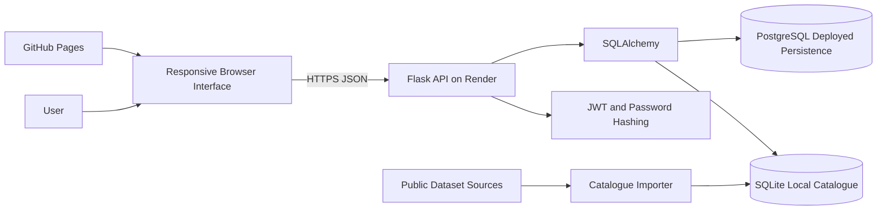
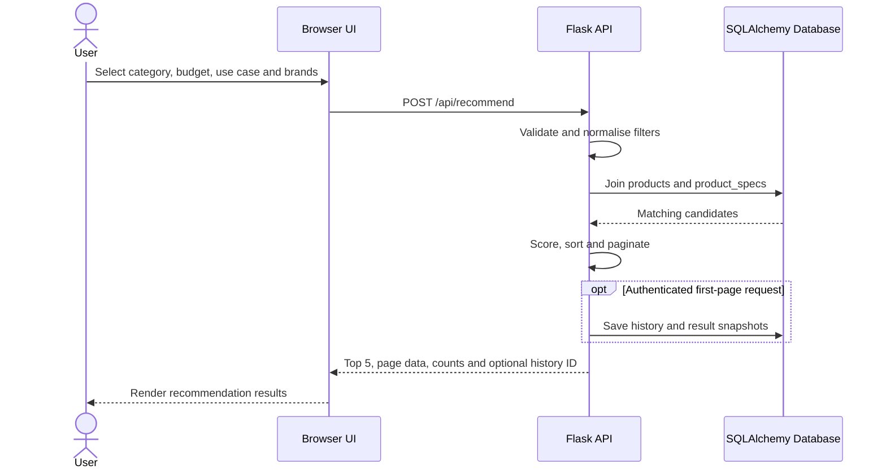
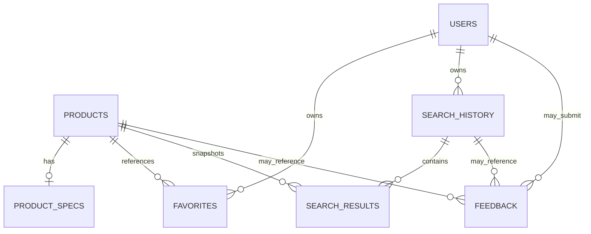
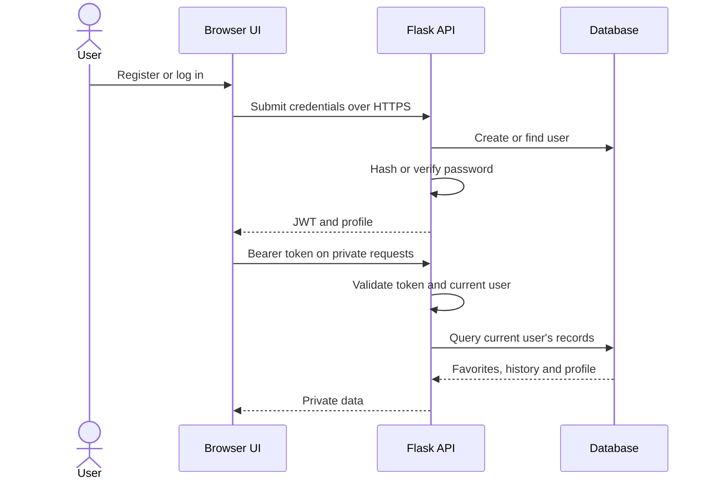

# Design and Architecture

**Project:** Smart Digital Product Recommendation Platform  
**Authoritative implementation baseline:** `feature/product-database`  
**Meeting and document record maintained by:** @Chu-Junjie  
**Status:** Prepared for formal technical review

## 1. Record basis

The architecture scope and review assignments are documented in the team meeting notes maintained by @Chu-Junjie. This document describes repository implementation and design intent. It does not prove the deployed commit, PostgreSQL persistence, browser E2E or external acceptance.

## 2. Named review responsibilities

- @ZhengZaikun confirms backend, API, authentication, recommendation, pagination and automated-test descriptions.
- @tiantian09091 confirms schema, relationships, catalogue, importer, provenance and PostgreSQL descriptions.
- @Guanyu-Lu confirms interface, GitHub Pages, responsive behaviour, accessibility and browser-flow descriptions.
- @Chu-Junjie maintains meeting notes, document structure, evidence boundaries and release links.

## 3. System context

The browser interface collects structured preferences such as category, budget, use case, preferred brand and excluded brand. It calls a Flask REST API, which joins product behaviour with recommendation-ready specifications, applies deterministic filtering and scoring, and returns a separate Top 5 plus paginated results.

Users may search anonymously. Registered users can maintain private favorites, search history, saved result snapshots and feedback.

## 4. Deployment boundaries

- @Guanyu-Lu maintains the static browser interface and confirms the GitHub Pages source and visible commit.
- @ZhengZaikun maintains the Flask API and confirms the Render API commit, startup and health behaviour.
- @tiantian09091 confirms the deployed PostgreSQL identity, schema, catalogue counts and persistence.
- @Chu-Junjie records the deployment evidence and release status.

Repository configuration indicates the intended deployment model. Exact deployed identity and behaviour remain `Unverified` until Issue #42 and the database runtime checks are executed.

## 5. API design

| Endpoint group | Purpose | Authentication |
|---|---|---|
| `/api/health` | API/database health and counts | Public |
| `/api/auth/register` | Create a password-hashed account and issue a token | Public submission |
| `/api/auth/login` | Validate credentials and issue a token | Public submission |
| `/api/auth/me` | Return the current profile | Required |
| `/api/recommend` | Return filters, Top 5, page results and optional history ID | Search public; history save requires valid token |
| `/api/products` | Browse/filter products with pagination | Public |
| `/api/compare` | Compare supported ProductIDs | Public in the current contract |
| `/api/favorites` | List, add and remove private favorites | Required |
| `/api/history` | List, restore and delete private history/snapshots | Required |
| `/api/feedback` | Record recommendation feedback | Public or account-linked where supported |

@ZhengZaikun formally confirms methods, validation, response fields and authorization rules before merge.

## 6. Recommendation flow

The current ranking is deterministic and explainable. Results are sorted by match score and price according to the implemented contract. @ZhengZaikun confirms the final scoring description and @Guanyu-Lu verifies the deployed presentation.

US-09 Budget Alternatives is Deferred. The current release filters by maximum budget but does not separately identify a cheaper equivalent product.

## 7. Database model

### Table responsibilities

| Table | Purpose |
|---|---|
| `products` | Behavioural and commercial attributes |
| `product_specs` | Names, specifications, use cases, URLs and provenance |
| `users` | Account identity and password hash |
| `favorites` | Private user/product selections |
| `search_history` | Private query/filter records |
| `search_results` | Ranked snapshots retained with history |
| `feedback` | Recommendation response records |

@tiantian09091 confirms keys, relationships, delete behaviour, catalogue counts and PostgreSQL compatibility. @ZhengZaikun confirms how the API reads and writes these tables.

## 8. Catalogue design

The repository targets:

- 11,000 total product rows;
- 2,000 recommendation-ready specification rows;
- category distribution of 800 laptops, 833 smartphones, 300 smart watches, 61 headphones and 6 tablets.

The catalogue stores source metadata and historical price treatment. @tiantian09091 confirms source/licence wording and runs the importer against a disposable build copy. The importer must not run against production user data.

## 9. Authentication and privacy

- @ZhengZaikun confirms password hashing, JWT validation and user-scoped API queries.
- @tiantian09091 confirms persistence and database relationships.
- @Guanyu-Lu confirms login/logout and private-view behaviour in the deployed browser.
- @Chu-Junjie records evidence without credentials or tokens.

## 10. Interface design

Primary views:

1. preference input and optional account access;
2. recommendation results, Top 5 and pagination;
3. account, favorites and history;
4. comparison;
5. feedback and share state.

@Guanyu-Lu confirms desktop/mobile layout, loading/empty/error states, keyboard navigation, visible focus, labels, readable errors and zoom/reflow observations.

## 11. Engineering decisions

| Decision | Selected approach | Reason |
|---|---|---|
| Client delivery | Static HTML/CSS/JavaScript on GitHub Pages | Independent lightweight frontend deployment |
| API | Flask REST JSON service | Clear browser/API boundary |
| Data access | SQLAlchemy | Shared SQLite/PostgreSQL access |
| Authentication | Password hashing and JWT | Stateless authenticated API calls |
| Recommendation | Deterministic rules | Explainable scores and reasons |
| History | Query plus result snapshots | Restore the result state shown at search time |
| Result navigation | Separate Top 5 and pagination | Summary plus complete exploration |
| Provenance | `DataSource` and update fields | Traceable historical catalogue records |

## 12. Verification dependencies

| Area | Required evidence | Named confirmation |
|---|---|---|
| API and automated tests | Final-candidate canonical CI | @ZhengZaikun |
| Catalogue and PostgreSQL | Counts, integrity, engine identity and persistence | @tiantian09091, with API confirmation from @ZhengZaikun |
| Deployed browser | Desktop/mobile flows and accessibility observations | @Guanyu-Lu |
| External acceptance | Two non-team participant records | @Chu-Junjie |
| Reconciliation | File decisions and final PR approvals | @ZhengZaikun, @tiantian09091, @Guanyu-Lu; recorded by @Chu-Junjie |

## 13. Known limitations

- catalogue prices are historical snapshots, not live inventory;
- deployed frontend/API commit identity remains unverified until recorded;
- deployed PostgreSQL persistence and recovery remain unverified;
- browser E2E and external acceptance remain `Not Run`;
- US-09 is Deferred.

## 14. Completion criteria

- [ ] @ZhengZaikun formally approves backend/API/authentication/recommendation sections.
- [ ] @tiantian09091 formally approves database/catalogue/importer/PostgreSQL sections.
- [ ] @Guanyu-Lu formally approves frontend/responsive/accessibility sections.
- [ ] @Chu-Junjie confirms meeting-note and evidence-boundary consistency.
- [ ] Runtime evidence is linked after execution.

Formal approval confirms document accuracy only and does not replace runtime verification.